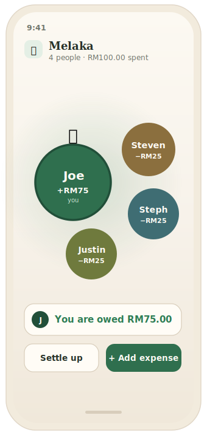
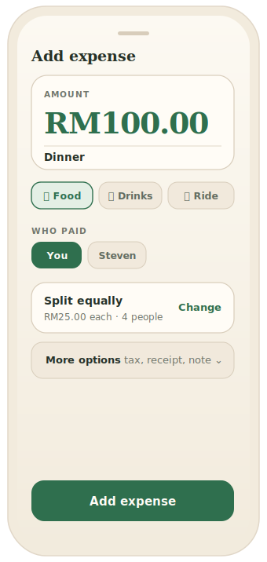
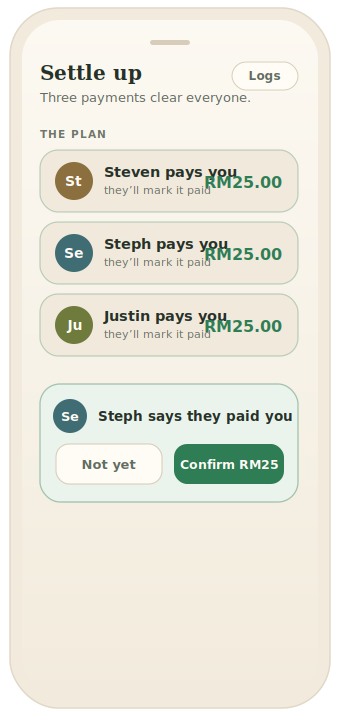
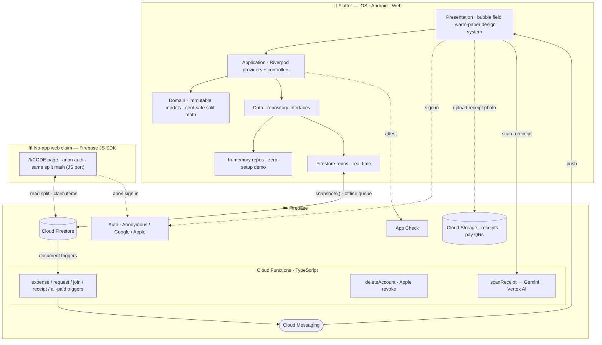

<div align="center">


# Bupples

**Split costs with friends — minus the awkward.**

[](https://flutter.dev)
[](https://firebase.google.com)
[](https://cloud.google.com/vertex-ai)
[](https://riverpod.dev)
[]()
[](LICENSE)

**[Live site → bupples.web.app](https://bupples.web.app)** · coming soon to the App Store

*A polished case study. The source code is private — available for review on request.*

</div>

---

## The idea

Splitting a group bill is a social tax: spreadsheets, screenshots, and chasing
friends for "the $14 you owe me." **Bupples** turns *who-owes-what* on any
hangout into a few taps — start a session, share a code (or a scannable QR),
drop expenses, and it computes the **fewest payments** to settle everyone up.

And for a one-off bill, **Turbo** turns it item-by-item: **snap the receipt**,
let everyone pick what they had, and Bupples splits it down to the line — tax and
service included — then shows each person what they owe and **how to pay it**.
Friends *without the app* can do all of that straight from the **browser**.
Built mobile-first, in a **warm-paper** design system (Fraunces display + DM Sans,
botanical-green accents, light and dark) with a living, physics-driven UI —
fronted by **Pip**, a two-bubble brand mark that's also a character: he breathes,
blinks, glances, reacts to your balance in real time, and dons a hat the instant
you settle up.

## Screenshots

| Bubble field | Add expense | Settle up | Invite (QR) |
|:---:|:---:|:---:|:---:|
|  |  |  |  |

> The home view is the **live bubble field** — members as physics-driven bubbles
> sized by balance, the host crowned. Add expenses with categories + tax/service,
> let Bupples compute the **fewest payments** to settle, and invite friends by
> **QR or code**. (Warm-paper mockups; the app ships light and dark.)

<div align="center">

_Demo walkthrough:_ <!-- drop a demo.gif or a YouTube/Loom link here -->

</div>

## What it does

- 🫧 **Live bubble field** — each member is a physics-driven, draggable bubble
  sized by their balance. The cluster is *interactive*: bubbles bounce off UI
  cards and float up out of the way when a sheet opens.
- 🧾 **Flexible expenses** — split **equally / by exact amounts / by percentage /
  by shares**, add **tax & service charge**, with a **60-second undo** window
  plus full edit & delete (with a change trail).
- ⚡ **Turbo receipt splits** — a fast, one-time split for a single bill. Tap
  Turbo, **snap a receipt**, and a split *materializes*: OCR itemizes it, the
  **currency is auto-detected** (or your default), your name + settings are
  pre-filled, and you land **straight on the share link** — no setup menu in the
  way. Each person **picks what they had** (shared dishes split evenly); Bupples
  computes every share with **tax & service riding proportionally**, shows who
  owes the payer, and surfaces **how to pay them**. Everything stays editable
  mid-split, so a mistake is a one-tap fix.
- 🖼️ **Profile pictures** — your photo (pulled from Google/Apple, or one you
  pick) fills your **bubble**, with the name riding a blur strip whose tint and
  text colour are **derived from the photo** so it stays legible over anything.
  Turn it off to go private — you see no one's, and no one sees yours — and it
  falls back to the lettered design.
- 💱 **Currency-aware balances** — Bupples never adds ringgit to dollars: your
  net is grouped **per currency**, leading with your default and listing every
  other currency you carry a balance in beneath it.
- ✏️ **Mutual renames** — opt-in per session: members can fix *each other's*
  display name (with a notification), for when autocorrect mangles a friend's.
- 👋 **First-run setup** — after sign-in, a warm three-beat flow — name (prefilled
  from your account) · currency · light/dark — with **Pip** idling along.
- 🧾 **Collaborative receipts** — inside a normal session, upload a receipt (scan
  it or type the items). The person who paid **reviews and confirms** the scan,
  then **everyone claims the items they had in real time** by tapping the row
  (shared items split evenly). Bupples turns it into one exact-split expense — tax,
  service and **discounts** included — and surfaces who owes the payer. Each person
  can **mark their share paid**; once everyone has, the owner gets a nudge to clean
  the receipt up, with its expense + breakdown kept in the log.
- 🌐 **No-app web claim** — share a Turbo link and friends **without the app**
  open it in a **browser**, pick their name, claim their items, and see what they
  owe — anonymous, no install — with a gentle nudge to get the app for the rest.
- 💸 **Transfer details** — attach **how to pay you** (method + handle + an
  optional QR/screenshot) to your profile, so anyone who owes you knows exactly
  where to send it — in both Turbo and regular sessions.
- 🤝 **Smart settle-up** — minimal **"who-pays-whom" debt simplification**
  (≤ N−1 transfers), via a request → confirm → undo flow, with optional
  **receipt-photo proof** attached to each transfer.
- 🔔 **Push notifications** — real-time alerts when someone adds an expense,
  requests a settle-up, joins your session, **uploads a receipt to claim**, or
  when **everyone's paid** a receipt or Turbo split (so the owner can clean it up).
  Driven by Firestore-triggered Cloud Functions over Firebase Cloud Messaging,
  with **deep links** that open straight to the right screen.
- 👥 **Sessions** — join by short code or **scannable QR**; configurable wrap-up
  (**host decides** or **unanimous vote**); per-session currency (+ custom) and
  budgets; **mid-session rule changes**; lock-on-close; **offline guests** (people
  at the table without the app, tracked by name and settled in person).
- 👑 **Host controls** — a crowned owner with **transferable ownership**, plus
  **kick / ban** and member moderation. Removing a session **archives** it —
  records preserved and exportable for everyone — never a silent wipe.
- 🔐 **Accounts** — silent anonymous by default; **Continue with Google** *or*
  **Sign in with Apple** links your data so it backs up and follows you across
  devices; one-tap **account deletion** that **anonymises rather than erases** —
  your name becomes "Deleted user" and your handles are dropped, but the shared
  expenses, transfers and receipts everyone else relies on stay intact (you
  can't delete your way out of a debt) — with Apple token revocation; local
  persistence so nothing resets.
- 🛡️ **Trust & safety** — **report** user-generated content (receipts) for
  moderation, and a terms/abuse policy — built to App Store UGC guidelines.
- 📊 **Per-member records** — tap a bubble for a breakdown of what they paid vs.
  owe and their full expense history.
- ♿ **Accessibility & polish** — haptics, reduce-motion support, and a bundled
  type system for offline-safe, flash-free first frames.

## Tech stack

| Layer | Choices |
|-------|---------|
| **App** | Flutter · Dart (iOS · Android · Web) |
| **State** | Riverpod (StreamProvider / Provider.family + controllers) |
| **Backend** | Firebase — Cloud Firestore (real-time sync), Auth (Anonymous · Google · Apple), **Cloud Functions** (push triggers, account deletion, Apple token revocation, **receipt scanning**), **Cloud Messaging** (push), **Cloud Storage** (receipts & payment QRs), **App Check**, Analytics |
| **Receipt AI** | **Gemini 2.5 Flash** via **Vertex AI** — structured receipt understanding (line-items + tax / service / **discount** / total, plus **store name** and **currency**, as JSON via a response schema) behind a callable function; the split math that consumes it is pure, unit-tested Dart |
| **Functions** | Node.js · TypeScript (Firebase Cloud Functions v2) |
| **Web (no-app) flow** | Static page on Firebase Hosting using the **Firebase JS SDK** + anonymous auth — no install needed to claim items |
| **iOS** | Swift Package Manager (no CocoaPods); UIScene lifecycle; Universal Links |
| **Design** | **Warm-paper** design system — Fraunces + DM Sans, botanical-green accents, light + dark — the **Pip** mascot as an animated `CustomPainter`, and a hand-rolled soft-body bubble simulation |

## Architecture

Feature-first and layered — UI depends only on repository **interfaces**, so the
in-memory backend and Firestore are interchangeable. A serverless backend
(Cloud Functions) handles everything that must be trusted, fan-out, or external:
push notifications, recursive account deletion, Apple token revocation, and
**receipt scanning** via Gemini on Vertex AI. People without the app reach a Turbo split from
a **browser**, talking to Firestore directly through the JS SDK under the same
Security Rules.



```
lib/
  app/theme/     design tokens + Material theme
  core/          palette, cent-safe money, deep links, services, shared widgets
  features/
    session/     sessions, expenses, members, settlement, transfer details,
                 collaborative real-time receipts (model · claims · settle · screen)
    turbo/        Turbo receipt splits — domain (split, items, claims, ledger,
                 receipt parser) · data · application · screens (create / share / claim)
    bubbles/     soft-body bubble simulation + render
    auth/        Google / Apple / anonymous sign-in
    settings/    profile, preferences, account deletion
    onboarding/  tutorial · sign-in gate · first-run setup (name · currency · theme)
functions/       Cloud Functions (TypeScript): notify, deleteAccount, apple, scanReceipt
public/          Firebase Hosting — the no-app /t/CODE web claim page + JS split-math port
```

## Engineering highlights

- **Debt-simplification ledger** — a greedy min-cash-flow algorithm reduces every
  pairwise IOU to the minimum number of transfers, computed purely from the
  expense stream.
- **Currency-correct aggregation** — balances are grouped by currency rather than
  summed: the home + activity heroes lead with your default currency and surface
  every other one as its own figure, so a `$` net and an `RM` net are never
  illegally added.
- **Privacy-preserving deletion** — account deletion runs server-side as an
  **anonymise**, not a purge: a transaction rewrites the leaving user's member
  entries to "Deleted user" and drops their uid + pay handles, while leaving the
  expenses, transfers and receipts the *other* participants depend on untouched —
  fraud-resistant by design (you can't erase shared proof or dodge a debt).
  Session removal is a tamper-resistant **soft-archive** (records frozen,
  exportable, restorable as read-only) rather than a destructive delete.
- **Palette-derived avatars** — profile photos drive the bubble fill, with the
  name set over a blur strip whose backdrop tint and text colour are computed
  from the image's dominant colour so it stays readable on any photo; a single
  mutual toggle opts a user out of the whole feature both ways.
- **Item-level receipt splitting** — a cent-conserving algorithm splits each line
  among its claimants and rides tax/service **proportionally** to what each person
  ordered (subtracting any **discount** the same way), distributing remainder cents
  deterministically so totals reconcile exactly. Written once in Dart and **ported
  to JavaScript for the web, guarded by a parity test** so the app and the browser
  agree to the cent — and **reused by Turbo and the collaborative session receipts**
  alike, so every split path agrees down to the last cent.
- **Receipt understanding** — a callable Cloud Function runs **Gemini 2.5 Flash
  on Vertex AI**, returning structured line-items + tax / service / total as JSON
  via a response schema (this replaced a brittle Cloud Vision OCR + text-heuristics
  pass that misread amounts and tax). The split math that consumes it is pure,
  unit-tested Dart, shared with the web.
- **Collaborative real-time receipts** — a receipt is a live Firestore object in a
  session with a per-member **claims** subcollection, so everyone taps the items
  they had and the shares update live for the whole table. Claims are
  **per-claimant documents** to keep concurrent writes contention-free; the payer
  is the owner (rules-gated edits), the scan is **reviewed before it goes live**,
  and on finalise it **materialises into one exact-split expense** so balances stay
  correct. A paid-tracking pass + a Cloud-Function nudge then lets the owner archive
  it once everyone has settled — the expense and its breakdown stay in the log.
- **No-app web participation** — a lightweight static page (Firebase JS SDK +
  anonymous auth) lets non-users claim items and see what they owe; **every write
  is scoped by Security Rules** — a guest can only append their own membership and
  write their own claim, never edit the receipt or another person's choices.
- **Soft-body bubble physics** — a custom simulation (cohesion + pairwise
  repulsion + idle drift + UI-obstacle collisions) drives a 60fps, draggable,
  reactive cluster, with a ticker that sleeps when idle/backgrounded.
- **Serverless push pipeline** — Firestore-triggered Cloud Functions fan out FCM
  notifications to a session's members (new expense, settle-up request, join,
  **receipt uploaded**, and **everyone-paid** nudges), each carrying a **deep-link
  payload** that opens straight to the relevant receipt, split, or session, with
  per-device token management that re-binds on account switch and prunes stale tokens.
- **Account-scoped image cache** — avatars are cached to a per-user on-device file
  store, keyed by the storage URL (which carries a version token), so they load
  instantly and never re-download, while a sign-out or account switch wipes the
  cache so one account can never surface another's faces. Built without a native
  database to stay on the project's CocoaPods-free Swift Package Manager setup.
- **Battery-aware lifecycle** — a top-level ticker freezes **every** animation in
  the app the instant it leaves the foreground (app switcher, Control Centre,
  background) and resumes on return, so a backgrounded Bupples costs nothing.
- **Cross-platform receipts** — transfer-proof images upload to Cloud Storage via
  a `dart:io`-free path (so it works on web too), gated by Security Rules and
  backed by UGC reporting/moderation.
- **App Store compliance** — Sign in with Apple alongside Google, server-side
  Apple **token revocation** on account deletion, and a recursive privileged
  data purge (Guideline 5.1.1(v)).
- **Security** — authorization is bound to the Firebase **auth uid** (not
  client-supplied ids): membership-scoped Firestore rules (no enumeration,
  members-only writes, **no client hard-deletes** — sessions soft-archive
  one-way and deleted accounts anonymise server-side, server-validated amounts,
  claim writes locked to the claimant) + **App Check**. Hardened after structured
  security audits.
- **Real-time + offline** — Firestore `snapshots()` push live updates to every
  participant; offline writes queue locally and flush on reconnect.

## Status

Preparing for **App Store** submission; running on iOS, Android, and Web, with the
no-app web claim flow live on Firebase Hosting. Currently on TestFlight build
**`1.0.0+15`** — see **[CHANGELOG.md](CHANGELOG.md)** for the build-by-build
history. The full source lives in a private repository — **happy to share read
access on request.**

---

<div align="center">

**Bupples** · © 2026 Yousof Selim · All Rights Reserved · Source available on request

</div>
