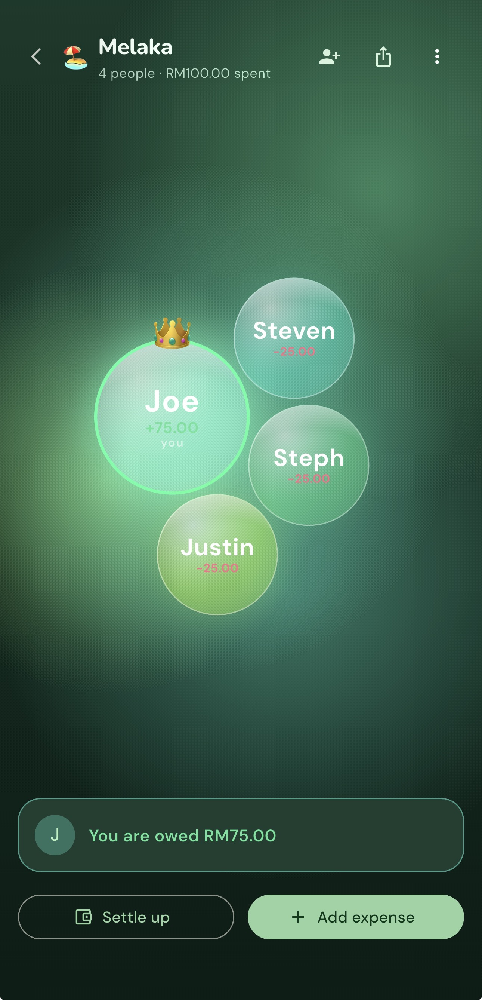
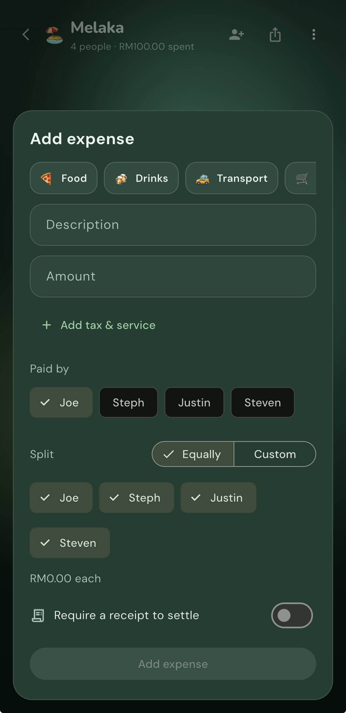
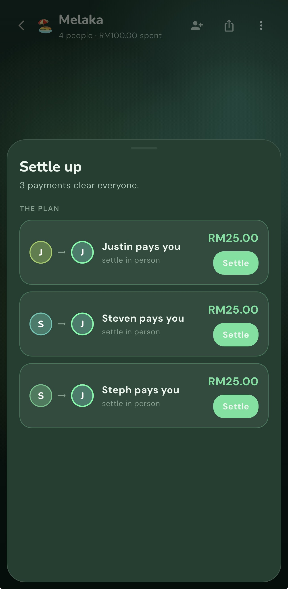
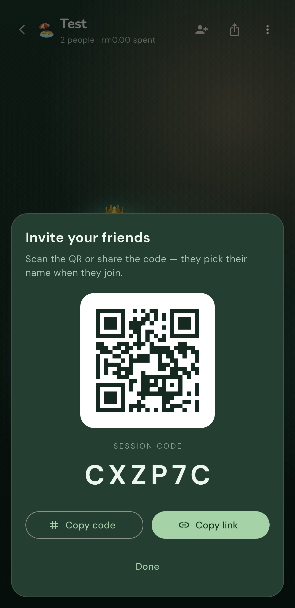
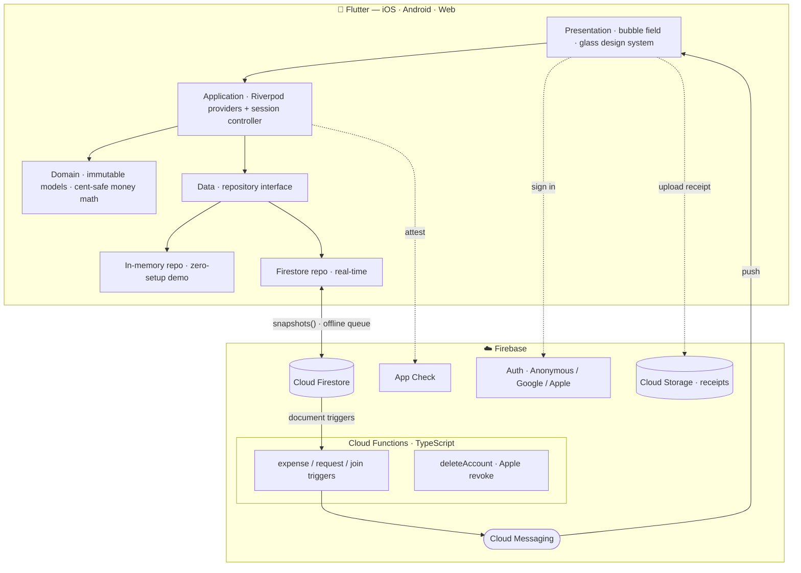

<div align="center">


# Bupples

**Split costs with friends — minus the awkward.**

[](https://flutter.dev)
[](https://firebase.google.com)
[](https://riverpod.dev)
[]()
[](LICENSE)

*A polished case study. The source code is private — available for review on request.*

</div>

---

## The idea

Splitting a group bill is a social tax: spreadsheets, screenshots, and chasing
friends for "the $14 you owe me." **Bupples** turns *who-owes-what* on any
hangout into a few taps — start a session, share a code (or a scannable QR),
drop expenses, and it computes the **fewest payments** to settle everyone up.
Built mobile-first for a Gen-Z audience, with a living, physics-driven UI.

## Screenshots

| Bubble field | Add expense | Settle up | Invite (QR) |
|:---:|:---:|:---:|:---:|
|  |  |  |  |

> The home view is the **live bubble field** — members as physics-driven bubbles
> sized by balance, the host crowned. Add expenses with categories + tax/service,
> let Bupples compute the **fewest payments** to settle, and invite friends by
> **QR or code**.

<div align="center">

_Demo walkthrough:_ <!-- drop a demo.gif or a YouTube/Loom link here -->

</div>

## What it does

- 🫧 **Live bubble field** — each member is a physics-driven, draggable bubble
  sized by their balance. The cluster is *interactive*: bubbles bounce off UI
  cards and float up out of the way when a sheet opens.
- 🧾 **Flexible expenses** — split **equally / by exact amounts / by percentage /
  by shares**, add **tax & service charge**, with a **60-second undo** window
  plus full edit & delete (with a change trail).
- 🤝 **Smart settle-up** — minimal **"who-pays-whom" debt simplification**
  (≤ N−1 transfers), via a request → confirm → undo flow, with optional
  **receipt-photo proof** attached to each transfer.
- 🔔 **Push notifications** — real-time alerts when someone adds an expense,
  requests a settle-up, or joins your session (Firebase Cloud Messaging, driven
  by Firestore-triggered Cloud Functions).
- 👥 **Sessions** — join by short code or **scannable QR**; configurable wrap-up
  (**host decides** or **unanimous vote**); per-session currency (+ custom) and
  budgets; **mid-session rule changes**; lock-on-close.
- 👑 **Host controls** — a crowned owner with **transferable ownership**, plus
  **kick / ban** and member moderation.
- 🔐 **Accounts** — silent anonymous by default; **Continue with Google** *or*
  **Sign in with Apple** links your data so it backs up and follows you across
  devices; one-tap **account deletion** (with Apple token revocation); local
  persistence so nothing resets.
- 🛡️ **Trust & safety** — **report** user-generated content (receipts) for
  moderation, and a terms/abuse policy — built to App Store UGC guidelines.
- 📊 **Per-member records** — tap a bubble for a breakdown of what they paid vs.
  owe and their full expense history.
- ♿ **Accessibility & polish** — haptics, reduce-motion support, and a bundled
  type system for offline-safe, flash-free first frames.

## Tech stack

| Layer | Choices |
|-------|---------|
| **App** | Flutter · Dart (iOS · Android · Web) |
| **State** | Riverpod (StreamProvider / Provider.family + a controller) |
| **Backend** | Firebase — Cloud Firestore (real-time sync), Auth (Anonymous · Google · Apple), **Cloud Functions** (push triggers, account deletion, Apple token revocation), **Cloud Messaging** (push), **Cloud Storage** (receipts), **App Check**, Analytics |
| **Functions** | Node.js · TypeScript (Firebase Cloud Functions v2) |
| **iOS** | Swift Package Manager (no CocoaPods); UIScene lifecycle |
| **Design** | Custom liquid-glass design system, a hand-rolled soft-body bubble simulation |

## Architecture

Feature-first and layered — UI depends only on repository **interfaces**, so the
in-memory backend and Firestore are interchangeable. A serverless backend
(Cloud Functions) handles everything that must be trusted or fan-out: push
notifications, recursive account deletion, and Apple token revocation.



```
lib/
  app/theme/     design tokens + Material theme
  core/          palette, cent-safe money, deep links, services, shared widgets
  features/
    session/     sessions, expenses, members, settlement, receipts
    bubbles/     soft-body bubble simulation + render
    auth/        Google / Apple / anonymous sign-in
    settings/    profile, preferences, account deletion
    onboarding/  tutorial + sign-in gate
functions/       Cloud Functions (TypeScript): notify, deleteAccount, apple
```

## Engineering highlights

- **Debt-simplification ledger** — a greedy min-cash-flow algorithm reduces every
  pairwise IOU to the minimum number of transfers, computed purely from the
  expense stream.
- **Soft-body bubble physics** — a custom simulation (cohesion + pairwise
  repulsion + idle drift + UI-obstacle collisions) drives a 60fps, draggable,
  reactive cluster, with a ticker that sleeps when idle/backgrounded.
- **Serverless push pipeline** — Firestore-triggered Cloud Functions fan out FCM
  notifications to a session's members, with per-device token management that
  re-binds on account switch and prunes stale tokens.
- **Cross-platform receipts** — transfer-proof images upload to Cloud Storage via
  a `dart:io`-free path (so it works on web too), gated by Security Rules and
  backed by UGC reporting/moderation.
- **App Store compliance** — Sign in with Apple alongside Google, server-side
  Apple **token revocation** on account deletion, and a recursive privileged
  data purge (Guideline 5.1.1(v)).
- **Security** — authorization is bound to the Firebase **auth uid** (not
  client-supplied ids): membership-scoped Firestore rules (no enumeration,
  members-only writes, host-only delete, server-validated amounts) + **App
  Check**. Hardened after a structured security audit.
- **Real-time + offline** — Firestore `snapshots()` push live updates to every
  participant; offline writes queue locally and flush on reconnect.

## Status

Preparing for **App Store** submission; running on iOS, Android, and Web. The
full source lives in a private repository — **happy to share read access on
request.**

---

<div align="center">

**Bupples** · © 2026 Yousof Selim · All Rights Reserved · Source available on request

</div>
