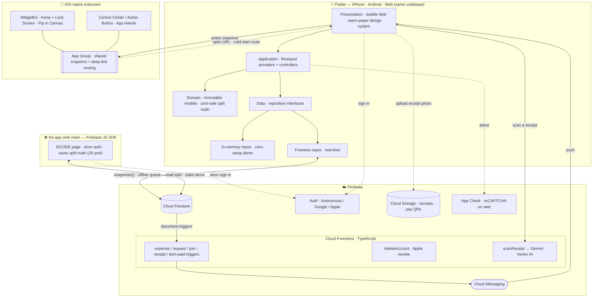

<div align="center">


# Bupples

**Split costs with friends — minus the awkward.**

### Scan a receipt, let everyone claim what they had *live*, and Bupples settles the group exactly — even for friends without the app.

[](https://flutter.dev)
[](https://firebase.google.com)
[](https://cloud.google.com/vertex-ai)
[](https://riverpod.dev)
[]()
[](https://bupples.web.app/app)
[](LICENSE)

**[Live site → bupples.web.app](https://bupples.web.app)** · the **full app now runs in the browser** · on **TestFlight** now — with home-screen **widgets** and **Control Center** actions — coming soon to the App Store

</div>

> **Source code is private while Bupples prepares for launch.** I'm happy to give
> read-only access to reviewers, recruiters, or collaborators on request — this is
> a deliberate pre-launch choice, not a hidden codebase.

---

## Demo

> ▶ **~30-second walkthrough:** **create a session → scan a receipt → everyone claims what they had → settle up.**

<!-- For maximum impact, drop a screen recording here:
       <p align="center"></p>
     or link a Loom / YouTube clip. -->

_Recording in progress — the four screens below show the key moments in the meantime._

## How it works

1. **Start a hangout** and share a short code or a scannable **QR**.
2. **Scan the receipt** — Gemini reads the items (with quantities), tax, service, discount, store and currency.
3. **Everyone claims what they had**, live — shared dishes split evenly, tax and service ride proportionally.
4. **Settle up** in the **fewest payments**, with how-to-pay details attached. Friends *without the app* do it all from the **browser**.

## The idea

Splitting a group bill is a social tax: spreadsheets, screenshots, and chasing
friends for "the $14 you owe me." **Bupples** turns *who-owes-what* on any
hangout into a few taps — start a session, share a code (or a scannable QR),
drop expenses, and it computes the **fewest payments** to settle everyone up.

And for a one-off bill, **Turbo** turns it item-by-item: **snap the receipt**,
let everyone pick what they had, and Bupples splits it down to the line — tax and
service included — then shows each person what they owe and **how to pay it**.
Friends *without the app* can do all of that straight from the **browser**.
Built mobile-first, in a **warm-paper** design system (Fraunces display + DM Sans,
botanical-green accents, light and dark) with a living, physics-driven UI —
fronted by **Pip**, a two-bubble brand mark that's also a character: he breathes,
blinks, glances, reacts to your balance in real time, and dons a hat the instant
you settle up.

## Screenshots

| Bubble field | Add expense | Settle up | Invite (QR) |
|:---:|:---:|:---:|:---:|
|  |  |  |  |

> The home view is the **live bubble field** — members as physics-driven bubbles
> sized by balance, the host crowned. Add expenses with categories + tax/service,
> let Bupples compute the **fewest payments** to settle, and invite friends by
> **QR or code**. (Warm-paper mockups; the app ships light and dark.)

## What it does

<details open>
<summary><b>The full feature set</b> — tap to collapse</summary>

<br />

- 🫧 **Live bubble field** — each member is a physics-driven, draggable bubble
  sized by their balance. The cluster is *interactive*: bubbles bounce off UI
  cards and float up out of the way when a sheet opens.
- 🧾 **Flexible expenses** — split **equally / by exact amounts / by percentage /
  by shares**, add **tax & service charge**, with a **60-second undo** window
  plus full edit & delete (with a change trail).
- ⚡ **Turbo receipt splits** — a fast, one-time split for a single bill. Tap
  Turbo, **snap a receipt**, and a split *materializes*: Gemini itemizes it
  (reading **quantities** too — "2 × Burger"), the **currency is auto-detected**
  (or your default), your name + settings are pre-filled, and you land **straight
  on the share link** — no setup menu in the way. Each person **picks what they
  had** (shared dishes split evenly); Bupples computes every share with **tax &
  service riding proportionally**, shows who owes the payer, and surfaces **how to
  pay them**. Everything stays editable mid-split, so a mistake is a one-tap fix.
- 🖼️ **Profile pictures** — your photo (pulled from Google/Apple, or one you
  pick) fills your **bubble**, with the name riding a blur strip whose tint and
  text colour are **derived from the photo** so it stays legible over anything.
  Turn it off to go private — you see no one's, and no one sees yours — and it
  falls back to the lettered design.
- 💱 **Currency-aware balances** — Bupples never adds ringgit to dollars: your
  net is grouped **per currency**, leading with your default and listing every
  other currency you carry a balance in beneath it.
- ✏️ **Mutual renames** — opt-in per session: members can fix *each other's*
  display name (with a notification), for when autocorrect mangles a friend's.
- 👋 **First-run setup** — after sign-in, a warm three-beat flow — name (prefilled
  from your account) · currency · light/dark — with **Pip** idling along.
- 🧾 **Collaborative receipts** — inside a normal session, upload a receipt (scan
  it or type the items). The person who paid **reviews and confirms** the scan,
  then **everyone claims the items they had in real time** by tapping the row
  (shared items split evenly) — and **everyone's balances move live as items are
  claimed**, before the receipt is even finalised. Bupples turns it into one
  exact-split expense — tax, service and **discounts** included — and surfaces who
  owes the payer (counted exactly once when it lands). Settling is
  tracked **per item**: each person ticks off the items they've actually paid for,
  and the "everyone's settled" nudge fires only once **every owed item** is paid —
  with its expense + breakdown kept in the log.
- ✍️ **Receipt edits, locks & an audit trail** — before a receipt is settled, the
  payer can fix an item's name, amount or quantity; anyone else can **suggest a
  correction** the owner approves or declines, and every change lands in a
  tamper-evident **edit history**. Once a receipt is added to balances it
  **locks** — items, amounts and title can no longer drift from the recorded proof
  (enforced in the app *and* the security rules).
- 📲 **iOS widgets & Control Center** — a full WidgetKit family (Small · Medium ·
  Large · iPad Extra-Large, plus Lock-Screen Circular / Rectangular / Inline,
  StandBy-friendly) shows your net at a glance, who you owe / who owes you, recent
  hangouts, and quick Activity / Join / Create taps — with **Pip drawn natively**,
  expression keyed to your balance, themed to your accent in light and dark. Two
  **Control Center controls** (iOS 18) — **Quick Turbo Split** and **Quick Add
  Expense** — sit on Control Centre, the Lock Screen, or the Action Button and open
  Bupples straight into that flow, even from a cold start.
- 🌐 **Bupples on the web** — the **full app** now runs in the browser at
  *bupples.web.app/app*: sign in, see your hangouts and balances, join a normal
  session or a Turbo split from a link, and settle up — guarded by **App Check**
  (reCAPTCHA) like mobile. A shared link opens the app if you have it and otherwise
  hands off cleanly to the web version. Friends **without the app** can still claim
  a Turbo split **anonymously** — pick a name, claim their items, see what they owe,
  no install — with a gentle nudge to get the app for the rest.
- 💸 **Transfer details** — attach **how to pay you** (method + handle + an
  optional QR/screenshot) to your profile, so anyone who owes you knows exactly
  where to send it — in both Turbo and regular sessions.
- 🤝 **Smart settle-up, your way** — Bupples nets the group into the **fewest
  payments** (≤ N−1 transfers) by default, and a personal **Summary / Full** switch
  lets you flip to the exact **who-owes-whom** breakdown — *your* view only, never
  anyone else's and never the balances. Settling runs request → confirm → undo, with
  optional **receipt-photo proof** on each transfer.
- 🔔 **Nudges that stay friendly** — a quiet **Nudge** appears only on someone who
  **directly owes you** (never a routed-through balance, never an offline guest, never
  when you're square); one tap sends one polite reminder that opens straight to Settle
  Up, with a **per-person cooldown** so no one gets spammed and a **server-written
  log** of who reminded whom that can't be forged.
- 💱 **Spend in any currency** — add an expense in a different currency and Bupples
  converts it to the hangout's currency at **that day's rate**, **locked in** so the
  totals never drift; each share converts cent-exactly, and the original amount + rate
  ride along on the expense.
- 📤 **Export a hangout** — share a clean **summary** or a **CSV** of every expense
  and payment from the session log (native share sheet on mobile, download on web).
- 🔔 **Push notifications** — real-time alerts when someone adds an expense,
  requests a settle-up, joins your session, **uploads a receipt to claim**, or
  when **everyone's paid** a receipt or Turbo split (so the owner can clean it up).
  Driven by Firestore-triggered Cloud Functions over Firebase Cloud Messaging,
  with **deep links** that open straight to the right screen.
- 👥 **Sessions** — join by short code or **scannable QR**; configurable wrap-up
  (**host decides** or **unanimous vote**); per-session currency (+ custom) and
  budgets; **mid-session rule changes**; lock-on-close; **offline guests** (people
  at the table without the app, tracked by name and settled in person).
- 👑 **Host controls** — a crowned owner with **transferable ownership**, plus
  **kick / ban** and member moderation. Removing a session **archives** it —
  records preserved and exportable for everyone — never a silent wipe.
- 🔐 **Accounts** — silent anonymous by default; **Continue with Google** *or*
  **Sign in with Apple** links your data so it backs up and follows you across
  devices; one-tap **account deletion** that **anonymises rather than erases** —
  your name becomes "Deleted user" and your handles are dropped, but the shared
  expenses, transfers and receipts everyone else relies on stay intact (you
  can't delete your way out of a debt) — with Apple token revocation; local
  persistence so nothing resets.
- 🛡️ **Trust & safety** — **report** user-generated content (receipts) for
  moderation, and a terms/abuse policy — built to App Store UGC guidelines.
- 📊 **Per-member records** — tap a bubble for a breakdown of what they paid vs.
  owe, what they've settled, and their full expense history — **reconciling in real
  time**, even while a receipt is still being claimed — with a one-tap **Nudge** when
  they owe you.
- ♿ **Accessibility & polish** — haptics, reduce-motion support, and a bundled
  type system for offline-safe, flash-free first frames.

</details>

## Tech stack

| Layer | Choices |
|-------|---------|
| **App** | Flutter · Dart (iOS · Android · Web) |
| **State** | Riverpod (StreamProvider / Provider.family + controllers) |
| **Backend** | Firebase — Cloud Firestore (real-time sync), Auth (Anonymous · Google · Apple), **Cloud Functions** (push triggers, server-verified settle-up, account deletion, Apple token revocation, **receipt scanning**, **daily FX rates**, **settle-up reminders + nudges**), **Cloud Messaging** (push), **Cloud Storage** (receipts & payment QRs), **App Check**, Analytics + Crashlytics |
| **Receipt AI** | **Gemini 2.5 Flash** via **Vertex AI** — structured receipt understanding (line-items + tax / service / **discount** / total, plus **store name** and **currency**, as JSON via a response schema) behind a callable function; the split math that consumes it is pure, unit-tested Dart |
| **Functions** | Node.js · TypeScript (Firebase Cloud Functions v2) |
| **Web** | The **full Flutter web app** on Firebase Hosting (App Check via reCAPTCHA), with link hand-off from shared session / Turbo links; **plus** a lightweight **Firebase JS SDK + anonymous-auth** claim page so friends without the app can join a Turbo split with no install |
| **iOS** | Swift Package Manager (no CocoaPods); UIScene lifecycle; Universal Links + custom-scheme deep links; **WidgetKit** (home-screen + Lock-Screen, Pip drawn in SwiftUI `Canvas`) and **App Intents / Control widgets** (iOS 18), sharing state through an **App Group** |
| **Design** | **Warm-paper** design system — Fraunces + DM Sans, botanical-green accents, light + dark — the **Pip** mascot as an animated `CustomPainter`, and a hand-rolled soft-body bubble simulation |

## Architecture

Feature-first and layered — UI depends only on repository **interfaces**, so the
in-memory backend and Firestore are interchangeable. A serverless backend
(Cloud Functions) handles everything that must be trusted, fan-out, or external:
push notifications, recursive account deletion, Apple token revocation, and
**receipt scanning** via Gemini on Vertex AI. The same Flutter codebase ships as
the iPhone app, the **full web app** (Firebase Hosting), and the native **iOS
widgets + Control Center** extension, which share live state through an App Group.
People without the app reach a Turbo split from a **browser** too, talking to
Firestore directly through the JS SDK under the same Security Rules.



```
lib/
  app/theme/     design tokens + Material theme
  core/          palette, cent-safe money, deep links, services, shared widgets
  features/
    session/     sessions, expenses, members, settlement, transfer details,
                 collaborative real-time receipts (model · claims · settle · screen)
    turbo/        Turbo receipt splits — domain (split, items, claims, ledger,
                 receipt parser) · data · application · screens (create / share / claim)
    bubbles/     soft-body bubble simulation + render
    auth/        Google / Apple / anonymous sign-in
    settings/    profile, preferences, account deletion
    onboarding/  tutorial · sign-in gate · first-run setup (name · currency · theme)
functions/       Cloud Functions (TypeScript): notify, deleteAccount, apple, scanReceipt
ios/
  Runner/        UIScene lifecycle + deep-link routing (native → Flutter)
  BupplesWidgets/  WidgetKit views, native Pip (SwiftUI Canvas), Control widgets,
                   shared snapshot via App Group
public/          Firebase Hosting — full Flutter web build at /app, the no-app
                 /t/CODE claim page, and the JS split-math port (parity-tested)
```

## Engineering highlights

- **Debt-simplification ledger** — a greedy min-cash-flow algorithm reduces every
  pairwise IOU to the minimum number of transfers, computed purely from the
  expense stream.
- **Currency-correct aggregation** — balances are grouped by currency rather than
  summed: the home + activity heroes lead with your default currency and surface
  every other one as its own figure, so a `$` net and an `RM` net are never
  illegally added.
- **Multi-currency without ledger drift** — an expense entered in another currency is
  converted to the session currency **at entry**, at that day's rate (a cached
  daily-rates Cloud Function over ECB / Frankfurter), so the stored ledger stays
  single-currency and never re-floats. Each person's weight is converted with the
  **same cent-exact distributor** as the split, and the original amount, currency and
  rate are kept on the expense for display and editing — editing re-bases cleanly.
- **Privacy-preserving deletion** — account deletion runs server-side as an
  **anonymise**, not a purge: a transaction rewrites the leaving user's member
  entries to "Deleted user" and drops their uid + pay handles, while leaving the
  expenses, transfers and receipts the *other* participants depend on untouched —
  fraud-resistant by design (you can't erase shared proof or dodge a debt).
  Session removal is a tamper-resistant **soft-archive** (records frozen,
  exportable, restorable as read-only) rather than a destructive delete.
- **Palette-derived avatars** — profile photos drive the bubble fill, with the
  name set over a blur strip whose backdrop tint and text colour are computed
  from the image's dominant colour so it stays readable on any photo; a single
  mutual toggle opts a user out of the whole feature both ways.
- **Item-level receipt splitting** — a cent-conserving algorithm splits each line
  among its claimants and rides tax/service **proportionally** to what each person
  ordered (subtracting any **discount** the same way), distributing remainder cents
  deterministically so totals reconcile exactly. Written once in Dart and **ported
  to JavaScript for the web, guarded by a parity test** so the app and the browser
  agree to the cent — and **reused by Turbo and the collaborative session receipts**
  alike, so every split path agrees down to the last cent.
- **Receipt understanding** — a callable Cloud Function runs **Gemini 2.5 Flash
  on Vertex AI**, returning structured line-items + tax / service / total as JSON
  via a response schema (this replaced a brittle Cloud Vision OCR + text-heuristics
  pass that misread amounts and tax). The split math that consumes it is pure,
  unit-tested Dart, shared with the web.
- **Collaborative real-time receipts** — a receipt is a live Firestore object in a
  session with a per-member **claims** subcollection, so everyone taps the items
  they had and the shares update live for the whole table. Claims are
  **per-claimant documents** to keep concurrent writes contention-free; the payer
  is the owner (rules-gated edits), the scan is **reviewed before it goes live**,
  and on finalise it **materialises into one exact-split expense** so balances stay
  correct. Pre-settle, edits are **owner-approved correction requests** logged to a
  tamper-evident history; post-settle the receipt **locks**. The expense and its
  breakdown stay in the log even after the owner archives it.
- **Live balance previews + read-side settle views** — an unfinalised receipt being
  claimed contributes a *preview* expense to the balance math (built from the same
  settlement the finaliser uses, dedup-guarded so it's counted once), so the whole
  table's balances — and each person's paid/share/owed breakdown — move in real time
  as items are ticked, then snap to the identical figure when it lands. The personal
  **Summary / Full** settle-up view is a pure read-side toggle over that one ledger,
  so both views reconcile to the cent. **Nudge eligibility always reads the direct
  pairwise debt** (never the simplified plan, so you can't nudge someone a routed
  balance only *appears* to send your way), and each nudge is appended to a
  **client-unwritable event log** by the reminder Cloud Function — so the
  who-nudged-whom record, like the rest of the audit trail, can't be forged.
- **Item-level paid tracking** — settle-up is recorded per line, not per person: a
  claim carries the set of item ids actually paid, and the "fully settled" state is
  decided **server-side** — true only when every split item is claimed *and* every
  debtor-claimed item is marked paid (with a legacy whole-share fallback for old
  data). So marking one item paid from the web or the app can never trip a false
  "everyone's paid" push, and a retry or reopen can't replay one (notify-locks
  de-dupe). The model is shared by Turbo and session receipts and ported to the web.
- **No-app web participation** — a lightweight static page (Firebase JS SDK +
  anonymous auth) lets non-users claim items and see what they owe; **every write
  is scoped by Security Rules** — a guest can only append their own membership and
  write their own claim, never edit the receipt or another person's choices.
- **Soft-body bubble physics** — a custom simulation (cohesion + pairwise
  repulsion + idle drift + UI-obstacle collisions) drives a 60fps, draggable,
  reactive cluster, with a ticker that sleeps when idle/backgrounded.
- **Serverless push pipeline** — Firestore-triggered Cloud Functions fan out FCM
  notifications to a session's members (new expense, settle-up request, join,
  **receipt uploaded**, the **item-exact "everyone's paid"** nudge, and a **polite
  "you still owe" reminder** — sent on demand or on a daily schedule for requests
  left unconfirmed), each carrying a **deep-link payload** that opens straight to the
  relevant receipt, split, settle-up, or session, with per-device token management
  that re-binds on account switch and prunes stale tokens. Reminders are
  **throttled per recipient** server-side so they can't be spammed.
- **Native iOS widgets & Control Center** — a separate WidgetKit + App Intents
  extension (no Flutter on the home screen): the app writes a compact balance
  snapshot to a shared **App Group**, which the widgets read to render the full
  family (home-screen sizes, Lock-Screen accessories, StandBy). **Pip is redrawn
  natively in a SwiftUI `Canvas`** — bubbles, Bézier eyes by mood — to stay on-model
  and crisp at every size, themed to the user's accent in light and dark. The iOS 18
  **Control widgets** (Quick Turbo Split, Quick Add Expense) fire an `OpenURLIntent`
  that the app routes through a native→Flutter MethodChannel, **including a cold
  start**: the launch URL is stashed, replayed once Flutter is ready, and the
  router restores the session before navigating. Built CocoaPods-free on the
  project's SPM-only setup (the embed/sign phases ordered to avoid a build cycle).
- **One Flutter codebase, three surfaces** — the same app compiles to the iPhone
  build, the **full web app** (served at `/app` on Firebase Hosting, App Check
  attested with reCAPTCHA v3), and feeds the native iOS extension. Shared session
  and Turbo links **hand off** intelligently — open the installed app via deep
  link, else continue in the web app — and the web build reuses the cent-exact
  split math through the parity-tested JS port.
- **Account-scoped image cache** — avatars are cached to a per-user on-device file
  store, keyed by the storage URL (which carries a version token), so they load
  instantly and never re-download, while a sign-out or account switch wipes the
  cache so one account can never surface another's faces. Built without a native
  database to stay on the project's CocoaPods-free Swift Package Manager setup.
- **Battery-aware lifecycle** — a top-level ticker freezes **every** animation in
  the app the instant it leaves the foreground (app switcher, Control Centre,
  background) and resumes on return, so a backgrounded Bupples costs nothing.
- **Cross-platform receipts** — transfer-proof images upload to Cloud Storage via
  a `dart:io`-free path (so it works on web too), gated by Security Rules and
  backed by UGC reporting/moderation.
- **App Store compliance** — Sign in with Apple alongside Google, server-side
  Apple **token revocation** on account deletion, and a recursive privileged
  data purge (Guideline 5.1.1(v)).
- **Security** — authorization is bound to the Firebase **auth uid** (not
  client-supplied ids): membership-scoped Firestore rules (no enumeration,
  members-only writes, **no client hard-deletes** — sessions soft-archive
  one-way and deleted accounts anonymise server-side, server-validated amounts,
  claim writes locked to the claimant) + **App Check**. Hardened after structured
  security audits.
- **Real-time + offline** — Firestore `snapshots()` push live updates to every
  participant; offline writes queue locally and flush on reconnect.

## Status

**Built for iPhone** and on **TestFlight** now (build **`1.0.0+28`** — see
**[CHANGELOG.md](CHANGELOG.md)** for the build-by-build history), preparing for
**App Store** submission, with native **home-screen widgets** and **Control Center**
actions. The **full web app** is live on Firebase Hosting at
**[bupples.web.app/app](https://bupples.web.app/app)** — and friends without the app
can still join a Turbo split from a plain browser. The app stays the better
experience, and **Android is on the way.** The full source lives in a private
repository — **happy to share read access on request.**

---

<div align="center">

**Bupples** · © 2026 Yousof Selim · All Rights Reserved · Source available on request

</div>
