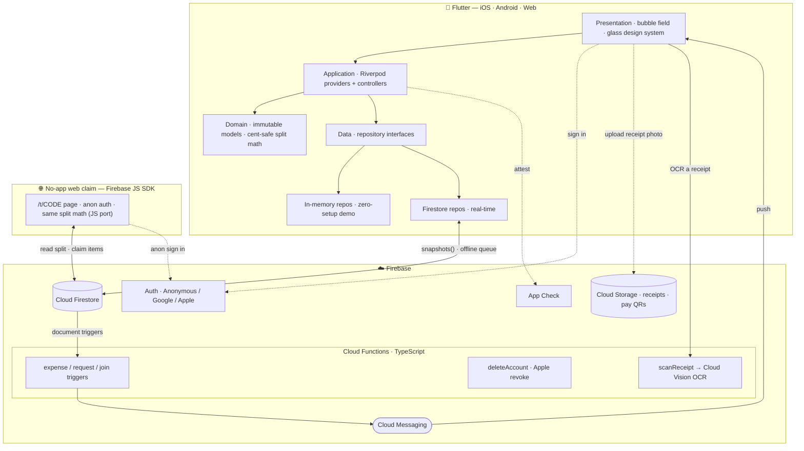

<div align="center">


# Bupples

**Split costs with friends — minus the awkward.**

[](https://flutter.dev)
[](https://firebase.google.com)
[](https://cloud.google.com/vision)
[](https://riverpod.dev)
[]()
[](LICENSE)

*A polished case study. The source code is private — available for review on request.*

</div>

---

## The idea

Splitting a group bill is a social tax: spreadsheets, screenshots, and chasing
friends for "the $14 you owe me." **Bupples** turns *who-owes-what* on any
hangout into a few taps — start a session, share a code (or a scannable QR),
drop expenses, and it computes the **fewest payments** to settle everyone up.

And for a one-off bill, **Turbo** turns it item-by-item: **snap the receipt**,
let everyone pick what they had, and Bupples splits it down to the line — tax and
service included — then shows each person what they owe and **how to pay it**.
Friends *without the app* can do all of that straight from the **browser**.
Built mobile-first for a Gen-Z audience, with a living, physics-driven UI.

## Screenshots

| Bubble field | Add expense | Settle up | Invite (QR) |
|:---:|:---:|:---:|:---:|
|  |  |  |  |

> The home view is the **live bubble field** — members as physics-driven bubbles
> sized by balance, the host crowned. Add expenses with categories + tax/service,
> let Bupples compute the **fewest payments** to settle, and invite friends by
> **QR or code**. Or **scan a receipt** and split it by the item.

<div align="center">

_Demo walkthrough:_ <!-- drop a demo.gif or a YouTube/Loom link here -->

</div>

## What it does

- 🫧 **Live bubble field** — each member is a physics-driven, draggable bubble
  sized by their balance. The cluster is *interactive*: bubbles bounce off UI
  cards and float up out of the way when a sheet opens.
- 🧾 **Flexible expenses** — split **equally / by exact amounts / by percentage /
  by shares**, add **tax & service charge**, with a **60-second undo** window
  plus full edit & delete (with a change trail).
- ⚡ **Turbo receipt splits** — a fast, one-time split for a single bill: **snap a
  receipt**, OCR itemizes it, share a link, and each person **picks what they
  had** (shared dishes split evenly). Bupples computes every share with **tax &
  service riding proportionally**, shows who owes the payer, and surfaces **how to
  pay them**.
- 🪄 **Scan & drag-to-assign** — inside a normal session, scan a receipt and
  **drag each member's bubble onto the items they ordered** (with a tap fallback
  for accessibility). Bupples turns the assignment into one exact-split expense —
  your settle-up settings still apply.
- 🌐 **No-app web claim** — share a Turbo link and friends **without the app**
  open it in a **browser**, pick their name, claim their items, and see what they
  owe — anonymous, no install — with a gentle nudge to get the app for the rest.
- 💸 **Transfer details** — attach **how to pay you** (method + handle + an
  optional QR/screenshot) to your profile, so anyone who owes you knows exactly
  where to send it — in both Turbo and regular sessions.
- 🤝 **Smart settle-up** — minimal **"who-pays-whom" debt simplification**
  (≤ N−1 transfers), via a request → confirm → undo flow, with optional
  **receipt-photo proof** attached to each transfer.
- 🔔 **Push notifications** — real-time alerts when someone adds an expense,
  requests a settle-up, or joins your session (Firebase Cloud Messaging, driven
  by Firestore-triggered Cloud Functions).
- 👥 **Sessions** — join by short code or **scannable QR**; configurable wrap-up
  (**host decides** or **unanimous vote**); per-session currency (+ custom) and
  budgets; **mid-session rule changes**; lock-on-close; **offline guests** (people
  at the table without the app, tracked by name and settled in person).
- 👑 **Host controls** — a crowned owner with **transferable ownership**, plus
  **kick / ban** and member moderation.
- 🔐 **Accounts** — silent anonymous by default; **Continue with Google** *or*
  **Sign in with Apple** links your data so it backs up and follows you across
  devices; one-tap **account deletion** (with Apple token revocation); local
  persistence so nothing resets.
- 🛡️ **Trust & safety** — **report** user-generated content (receipts) for
  moderation, and a terms/abuse policy — built to App Store UGC guidelines.
- 📊 **Per-member records** — tap a bubble for a breakdown of what they paid vs.
  owe and their full expense history.
- ♿ **Accessibility & polish** — haptics, reduce-motion support, and a bundled
  type system for offline-safe, flash-free first frames.

## Tech stack

| Layer | Choices |
|-------|---------|
| **App** | Flutter · Dart (iOS · Android · Web) |
| **State** | Riverpod (StreamProvider / Provider.family + controllers) |
| **Backend** | Firebase — Cloud Firestore (real-time sync), Auth (Anonymous · Google · Apple), **Cloud Functions** (push triggers, account deletion, Apple token revocation, **receipt OCR**), **Cloud Messaging** (push), **Cloud Storage** (receipts & payment QRs), **App Check**, Analytics |
| **OCR** | **Google Cloud Vision** (document text detection) behind a callable function; receipt-text → line-items parsing in pure, unit-tested Dart |
| **Functions** | Node.js · TypeScript (Firebase Cloud Functions v2) |
| **Web (no-app) flow** | Static page on Firebase Hosting using the **Firebase JS SDK** + anonymous auth — no install needed to claim items |
| **iOS** | Swift Package Manager (no CocoaPods); UIScene lifecycle; Universal Links |
| **Design** | Custom liquid-glass design system, a hand-rolled soft-body bubble simulation |

## Architecture

Feature-first and layered — UI depends only on repository **interfaces**, so the
in-memory backend and Firestore are interchangeable. A serverless backend
(Cloud Functions) handles everything that must be trusted, fan-out, or external:
push notifications, recursive account deletion, Apple token revocation, and
**receipt OCR** via Cloud Vision. People without the app reach a Turbo split from
a **browser**, talking to Firestore directly through the JS SDK under the same
Security Rules.



```
lib/
  app/theme/     design tokens + Material theme
  core/          palette, cent-safe money, deep links, services, shared widgets
  features/
    session/     sessions, expenses, members, settlement, receipts,
                 transfer details, scan-&-drag receipt assignment
    turbo/        Turbo receipt splits — domain (split, items, claims, ledger,
                 receipt parser) · data · application · screens (create / share / claim)
    bubbles/     soft-body bubble simulation + render
    auth/        Google / Apple / anonymous sign-in
    settings/    profile, preferences, account deletion
    onboarding/  tutorial + sign-in gate
functions/       Cloud Functions (TypeScript): notify, deleteAccount, apple, scanReceipt
public/          Firebase Hosting — the no-app /t/CODE web claim page + JS split-math port
```

## Engineering highlights

- **Debt-simplification ledger** — a greedy min-cash-flow algorithm reduces every
  pairwise IOU to the minimum number of transfers, computed purely from the
  expense stream.
- **Item-level receipt splitting** — a cent-conserving algorithm splits each line
  among its claimants and rides tax/service **proportionally** to what each person
  ordered, distributing remainder cents deterministically so totals reconcile
  exactly. Written once in Dart and **ported to JavaScript for the web, guarded by
  a parity test** so the app and the browser agree to the cent.
- **Receipt OCR pipeline** — a callable Cloud Function wraps **Google Cloud
  Vision**; the fuzzy "receipt text → line items + tax/service/total" parsing
  lives in a **pure, unit-tested Dart parser**, keeping the heuristics easy to
  iterate without backend round-trips.
- **Drag-to-assign UX** — Flutter `Draggable`/`DragTarget` let you drop member
  bubbles onto receipt items (with an accessible tap fallback), collapsing a
  whole receipt into one exact-split expense.
- **No-app web participation** — a lightweight static page (Firebase JS SDK +
  anonymous auth) lets non-users claim items and see what they owe; **every write
  is scoped by Security Rules** — a guest can only append their own membership and
  write their own claim, never edit the receipt or another person's choices.
- **Soft-body bubble physics** — a custom simulation (cohesion + pairwise
  repulsion + idle drift + UI-obstacle collisions) drives a 60fps, draggable,
  reactive cluster, with a ticker that sleeps when idle/backgrounded.
- **Serverless push pipeline** — Firestore-triggered Cloud Functions fan out FCM
  notifications to a session's members, with per-device token management that
  re-binds on account switch and prunes stale tokens.
- **Cross-platform receipts** — transfer-proof images upload to Cloud Storage via
  a `dart:io`-free path (so it works on web too), gated by Security Rules and
  backed by UGC reporting/moderation.
- **App Store compliance** — Sign in with Apple alongside Google, server-side
  Apple **token revocation** on account deletion, and a recursive privileged
  data purge (Guideline 5.1.1(v)).
- **Security** — authorization is bound to the Firebase **auth uid** (not
  client-supplied ids): membership-scoped Firestore rules (no enumeration,
  members-only writes, host-only delete, server-validated amounts, claim writes
  locked to the claimant) + **App Check**. Hardened after structured security
  audits.
- **Real-time + offline** — Firestore `snapshots()` push live updates to every
  participant; offline writes queue locally and flush on reconnect.

## Status

Preparing for **App Store** submission; running on iOS, Android, and Web, with the
no-app web claim flow live on Firebase Hosting. The full source lives in a private
repository — **happy to share read access on request.**

---

<div align="center">

**Bupples** · © 2026 Yousof Selim · All Rights Reserved · Source available on request

</div>
