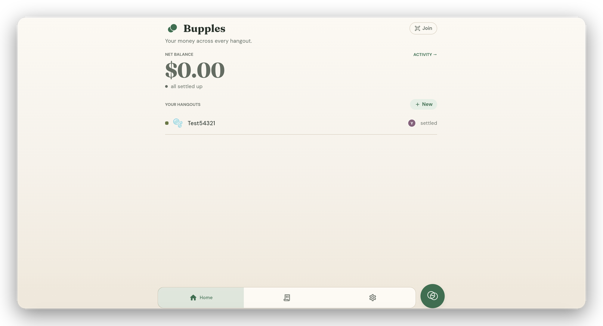

# Bupples

**Split costs with friends, minus the awkward.**

Scan a receipt, let everyone claim what they had live, and Bupples settles the
group to the cent — even friends without the app.

**[bupples.web.app](https://bupples.web.app)** · the full app runs in the browser at **[/app](https://bupples.web.app/app)** · on **TestFlight** for iPhone, App Store soon

> A solo-designed and -built product: the Flutter app, the Firebase backend and
> Cloud Functions, the native iOS widget + Control Center extension, and the web
> app. **Source is private while Bupples prepares for launch** — happy to share
> read-only access with reviewers, recruiters, or collaborators on request.

---

## Screenshots

| Session · bubble field | Home | Activity | Settings |
|:---:|:---:|:---:|:---:|
|  |  |  |  |

> The signature view is the **live bubble field** — each member a physics-driven
> bubble sized by their balance, the host crowned, with a scanned receipt mid-review
> up top. Shown in dark mode; the app ships light and dark.

<em>…and the same app, in the browser:</em>

## How it works

1. **Start a hangout** and share a short code or a scannable **QR**.
2. **Scan the receipt** — Gemini reads the items (with quantities), tax, service,
   discount, store, and currency.
3. **Everyone claims what they had**, live — shared dishes split evenly, tax and
   service ride proportionally, and balances move in real time as items are ticked.
4. **Settle up** in the fewest payments, with how-to-pay details attached. Friends
   *without the app* do it from the browser.

Spend in another currency and Bupples converts it at that day's locked-in rate;
more than one person paid and you add every payer — the ledger stays exact either way.

## What makes it different

Not "a better Splitwise" — a different mechanism. Most splitters divide a bill
*evenly* and leave the chasing to you.

| | A basic bill splitter | Bupples |
|---|---|---|
| **The receipt** | A photo you attach | Scanned, then **everyone claims their items** live |
| **Tax & service** | Split evenly | Ride **proportionally** to what each person ordered |
| **Who paid** | One payer | **Multiple payers** per bill, cent-exact |
| **No-app friends** | Need an account | **Claim from a browser**, no install |
| **Chasing** | Awkward texts | One quiet, friendly **nudge** |

## Features

- 🫧 **Live bubble field** — each member is a draggable, physics-driven bubble
  sized by their balance; tap one for a full breakdown that reconciles in real time.
- 🧾 **Scan & claim receipts** — Gemini reads the items; everyone taps what they
  had and the split lands to the cent, tax, service, and discount included.
  → [receipt splitting](docs/receipt-splitting.md)
- 👛 **Multiple payers** — one bill fronted by more than one person, split equally
  or by exact amounts, with balances that stay cent-exact.
  → [the money model](docs/receipt-splitting.md#multiple-payers-build-29)
- ⚡ **Turbo split** — a fast one-off: snap, everyone claims, see who owes whom —
  and friends without the app claim from a browser.
  → [web & native](docs/web-and-native.md#no-app-participation)
- 🤝 **Smart settle-up** — the **fewest payments** by default, or flip to the full
  who-owes-whom view (your eyes only, never the balances).
  → [settle-up views](docs/receipt-splitting.md#settle-up-views)
- 🔔 **Friendly nudges** — a quiet reminder that appears only on someone who
  *directly* owes you, with a per-person cooldown and a server-written log.
- 📲 **iOS widgets & Control Center** — a full WidgetKit family plus two iOS 18
  controls, with Pip drawn natively. → [web & native](docs/web-and-native.md#ios-widgets-and-control-center)
- 🌐 **Full web app** — the whole app in the browser at
  [bupples.web.app/app](https://bupples.web.app/app), App Check attested like mobile.
- 🔐 **Privacy-first accounts** — anonymous by default; Google or Apple to back up;
  deletion **anonymizes instead of erasing**, so no one can delete their way out of
  a debt. → [privacy & deletion](docs/privacy-and-deletion.md)

## Engineering highlights

The decisions that were hard, and why they went the way they did. Depth lives in
[`docs/`](#documentation).

- **One money implementation, two languages.** The cent-safe split math is written
  once in Dart and ported to JavaScript for the web, **guarded by a parity test** so
  the app and the browser agree to the cent — and reused by Turbo, collaborative
  session receipts, and plain expenses alike.
- **A multi-payer ledger that doesn't double-count.** Settling multiple payers by
  spreading each consumer's gross share across payers double-counts a payer who also
  consumed; Bupples works in **net positions** instead, staying exact for any mix of
  payers and consumers and reducing to the simple case for one payer. The model is
  backward-compatible — single-payer records are byte-identical and need no
  migration. → [the money model](docs/receipt-splitting.md#multiple-payers-build-29)
- **Collaborative real-time receipts.** A receipt is a live Firestore object with a
  **per-claimant** `claims` subcollection (concurrent writes never contend); an
  unfinalized receipt contributes a dedup-guarded *preview* to the balance math, so
  the whole table's numbers move as items are ticked and then snap to the identical
  figure when it lands. → [receipt splitting](docs/receipt-splitting.md#collaborative-real-time-receipts)
- **Server-authoritative trust.** Settle-up acceptance, the item-exact "everyone's
  paid" event, and account deletion are decided **on the server** — clients propose,
  Cloud Functions and Security Rules dispose — and audit logs are written by Cloud
  Functions so clients can't rewrite them.
- **Privacy-preserving deletion.** Account deletion runs server-side as an
  **anonymize, not a purge**, leaving the shared records other people depend on
  intact, with Apple token revocation. → [privacy & deletion](docs/privacy-and-deletion.md)
- **One codebase, three surfaces.** The same Flutter app compiles to the iPhone
  build, the full web app (WebAssembly `skwasm` renderer, tuned to drop the browser's
  most expensive per-frame work), and feeds a native iOS widget + Control Center
  extension via a shared App Group with cold-start deep-link routing.
  → [web & native](docs/web-and-native.md)
- **Receipt understanding via Gemini.** A callable Cloud Function runs **Gemini 2.5
  Flash on Vertex AI**, returning structured line-items + tax / service / discount /
  total as JSON; the model fills in the numbers, the unit-tested Dart math decides
  the split. → [receipt splitting](docs/receipt-splitting.md#receipt-understanding-the-scan)

## Tech stack

| Layer | Choices |
|-------|---------|
| **App** | Flutter · Dart (iOS · Android · Web) |
| **State** | Riverpod (`StreamProvider` / `Provider.family` + controllers) |
| **Backend** | Firebase — Firestore (real-time sync), Auth (Anonymous · Google · Apple), Cloud Functions, Cloud Messaging, Cloud Storage, App Check, Analytics + Crashlytics |
| **Receipt AI** | Gemini 2.5 Flash via Vertex AI — structured receipt JSON behind a callable function; the split math that consumes it is pure, unit-tested Dart |
| **Functions** | Node.js · TypeScript (Cloud Functions v2) |
| **Web** | The full Flutter web app on Firebase Hosting (WebAssembly renderer), plus a lightweight JS SDK + anonymous-auth claim page for friends without the app |
| **iOS** | Swift Package Manager (no CocoaPods); WidgetKit + App Intents (Pip in SwiftUI `Canvas`); Universal Links + deep links |
| **Design** | Warm-paper system — Fraunces + DM Sans, botanical-green accents, light + dark; the **Pip** mascot as an animated `CustomPainter`; a hand-rolled soft-body bubble simulation |

## Architecture

Feature-first and layered: the UI depends only on repository *interfaces*, so an
in-memory demo backend and Firestore are interchangeable, and everything that must
be trusted runs on the server. The same codebase is the iPhone app, the full web
app, and the data source behind the native iOS extension.

**[Read the architecture overview →](docs/architecture.md)** (with a system diagram)

## Documentation

| Doc | What's inside |
|-----|---------------|
| [Architecture](docs/architecture.md) | Layers, the system diagram, the serverless push pipeline, three surfaces from one codebase |
| [Receipt splitting & the money model](docs/receipt-splitting.md) | Cent-safe math, the multi-payer net-position ledger, collaborative real-time receipts, Dart ↔ JS parity |
| [Privacy & deletion](docs/privacy-and-deletion.md) | Anonymize-not-erase, soft-archive, server-authoritative trust, Security Rules |
| [Web & native](docs/web-and-native.md) | The full web app + performance pass, the no-app claim flow, iOS widgets + Control Center |
| [App Store readiness](docs/app-store-readiness.md) | TestFlight status, compliance, quality checklist |

## Status

Live on **TestFlight** at build **`1.0.0+29`** ([CHANGELOG](CHANGELOG.md)), preparing
for App Store submission. The full web app is live at
[bupples.web.app/app](https://bupples.web.app/app). The app stays the better
experience, and Android is on the way.

| Surface | Status |
|---------|--------|
| iPhone app | ✅ Live on TestFlight (`1.0.0+29`) |
| Web app | ✅ Live at [bupples.web.app/app](https://bupples.web.app/app) |
| iOS widgets + Control Center | ✅ Shipping |
| App Store | 🚧 Preparing submission |
| Android | 📋 Planned |

---

**Bupples** · © 2026 Yousof Selim · All Rights Reserved · [License](LICENSE)

