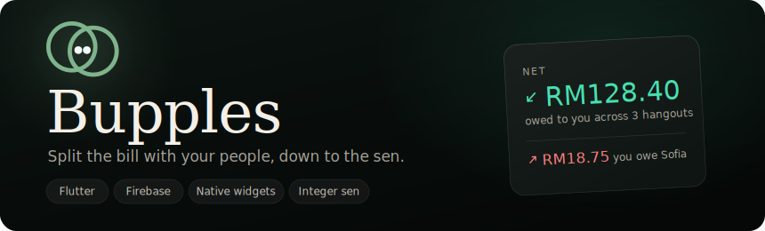
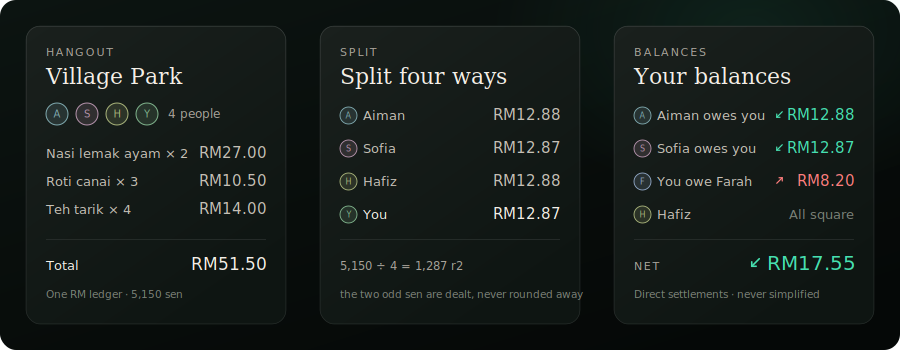
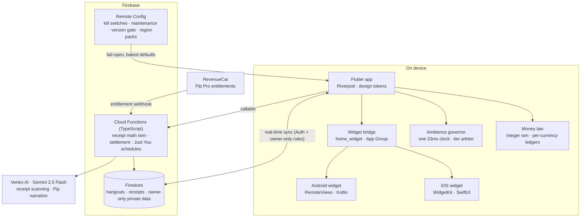

  

<h1 align="center">Bupples</h1>

  <em>Split the bill with your people, minus the awkward.</em> 
  A dark-first, glassmorphic money app for hangouts: strict arithmetic underneath, a character on top.

  
  
  
  
  
  
  

<blockquote align="center">
  <strong>Note:</strong> This is a showcase repository. It presents the product, the design, and the
  engineering. The application source is private.
</blockquote>

---

## Overview

**Bupples** is an expense-splitting app for **Malaysian Gen Z**, built around the **hangout**: the
dinner, the trip, the concert night. You scan the receipt, everyone claims what they actually had, and
the app settles the table to the sen.

The thesis is that a money app does not have to be cold. Splitting money with friends is a social act
before it is an arithmetic one, so Bupples runs two systems at once: a **money law** underneath that is
pedantic to the point of being enforced by tests, and **Pip**, a mascot and assistant, on top. The
discipline is what buys the personality. Because the figures are provably correct, the app can afford to
be warm about them.

That split runs through the whole codebase. Every monetary figure is integer sen, direction is carried
by an icon and a word rather than by colour alone, and two currencies are never folded into one number.
Pip can talk about your money, but Pip is structurally incapable of producing a figure.

  

  <em>RM51.50 over four people is RM12.875 each, which does not exist. Two get the extra sen by largest
  remainder, and the four shares add back to the total exactly. No split may lose or invent a sen.</em>

---

## Highlights

- 💸 **A money law that is enforced, not documented.** Integer sen everywhere; mint means owed to you,
  coral means you owe, gold is reserved for Pro. Your custom accent colour may never sit near a money
  hue: the picker computes a perceptual protection band in OKLCH and **snaps** the pick out of it,
  rotating hue while holding lightness, so the output is provably safe. Tests pin all of it.
- 🧮 **Currencies are independent ledgers with no FX.** Nothing that shows money may sum, blend, or
  convert across currencies. The old cross-currency total providers were deleted outright, and a test
  file exists specifically to keep them dead.
- 🎛️ **An ambience governor so decoration can never cost the frame budget.** One 33ms ambient clock
  drives every decorative pixel, with a tier ladder from A (lively) to D (static) resolved as
  `min(deviceCeiling, heatCeiling, powerCeiling)`. Stepping **down is immediate**; stepping **up is
  earned** over 90 clean seconds.
- 🤖 **An LLM that narrates money without ever producing a number.** The deterministic engine computes
  every figure; Pip only narrates. The exit is guarded by a pure, fail-closed validator that parses each
  monetary token out of Pip's output and rejects the whole narrative unless every figure was in the input
  payload. It is written and adversarially tested ahead of its call site: at `1.1.0+112` the deterministic
  engines still own every figure on screen, so nothing routes through it yet.
- 🧩 **Two native widget stacks, one payload.** iOS **WidgetKit** in SwiftUI (six families, Lock Screen
  accessories included) and Android **RemoteViews** in Kotlin, both fed by a single Dart payload through
  an App Group. Currency-aware, redacted when the device locks, and no widget ever makes a network call.
- 🎚️ **A remote control plane that fails open.** Kill switches for Pip, receipt scanning, nudges, and
  the paywall, plus maintenance mode, version gating, announcements, and region packs, all shipping with
  baked-in defaults so a dead config can never brick the app.

---

## Features

### Splitting and receipts
- Start a **hangout**, share a code or a QR, and split as you go.
- **Receipt scanning** via Gemini 2.5 Flash on Vertex AI: line items, quantities, tax, service, discount,
  store, and currency come back as structured JSON.
- **Per-item claiming**: everyone taps what they had; shared dishes divide evenly; tax, service, and
  discounts ride **proportionally** to what each person actually claimed.
- **Multi-payer, cent-exact**: more than one person can front a bill, and the ledger stays exact for any
  mix of payers and consumers.
- **Settle up** with payment details attached. Bupples records settlements; it never moves money.

### Just You
A private money space, separate from the social ledger. A deterministic engine derives one hero figure,
`money left = income - committed - spent - goal contributions`, in integer sen, and the same arithmetic
is mirrored in scheduled Cloud Functions so the server and the client never disagree.

### Widgets
Home and Lock Screen on iOS across six WidgetKit families, plus Android home-screen widgets, with a
second Pip-Pro-gated Just You widget. All of them read one shared payload and hold no logic of their own.

### Pip
The mascot, drawn natively rather than shipped as an asset, and an assistant built on Gemini via Vertex
AI. Pip is context-aware (screen, hangout, people, receipts) and is fenced off from arithmetic by design.

### Personalisation and Pip Pro
Accent themes, backgrounds, and a wardrobe for Pip, with subscriptions through RevenueCat. Every custom
accent is passed through the money-hue guardrail before it is allowed anywhere near the UI.

### Experience and accessibility
Dark-first glassmorphism. Fraunces for display, Hanken Grotesk for UI, JetBrains Mono with tabular
figures for money, so digits never jitter as balances recompute. Money semantics are never colour-only:
a sanctioned widget composes icon plus word plus figure, and asserts in debug builds that the word is
present whenever the colour is a money hue. Reduce Motion floors the ambience ladder app-wide.

---

## Architecture

**Design principle:** anything that must be trusted is computed deterministically and, where money is
written, computed **twice**. The client previews a figure with the Dart engine; the Cloud Function writes
it with a behaviourally identical TypeScript twin, and the two must agree to the sen. The model is never
in that path.

See [`docs/ARCHITECTURE.md`](docs/ARCHITECTURE.md) for the deep dive. Two subsystems carry enough rules
to have earned their own write-ups: [receipt splitting](docs/receipt-splitting.md), where the money law
gets stress-tested, and [privacy and deletion](docs/privacy-and-deletion.md). Release history is in the
[changelog](CHANGELOG.md).

---

## Tech stack

| Layer | Technology |
| --- | --- |
| App | **Flutter / Dart**, Riverpod, a token-driven design system |
| iOS | **Swift**, WidgetKit, SwiftUI, Swift Package Manager, native thermal channel |
| Android | **Kotlin**, App Widgets / RemoteViews, native thermal channel |
| Backend | **Firebase**: Firestore, Auth, Cloud Functions (**TypeScript**), Cloud Messaging, Storage, Remote Config, Crashlytics |
| AI | **Gemini 2.5 Flash via Vertex AI** for receipt understanding and Pip narration, behind callable functions |
| Payments | **RevenueCat** subscriptions for Pip Pro |
| Quality | More than 2,500 test cases across 321 test files, `flutter analyze` clean, real-device iOS and Android builds |

---

## Engineering notes

A few problems that were more interesting than they look:

- **The simplifying ledger that silently rerouted a real debt.** The settle engine can minimise the
  number of transfers by rerouting debts through third parties, and it defaults to on. That is correct
  for a whole-hangout settle plan and quietly **wrong** for any you-and-them surface, where it can hide
  or flip an actual pair debt. An adversarial review caught this shipping. The standing rule now: a pair
  surface always reads the direct ledger, `simplify: false`, and the call sites are pinned.
- **Two money implementations that have to agree to the sen.** Receipt claiming exists twice, in Dart for
  the live preview and in TypeScript for the function that actually writes money. The server twin does
  exact rational arithmetic in `bigint` so rounding is deterministic, and the invariants (claimed
  subtotals plus the unclaimed pot equal the item total exactly; proportional tax conserves to the sen
  via largest remainder) are property-tested rather than spot-checked.
- **Letting a model talk about money without letting it do maths.** The interesting part is not the
  prompt, it is the exit. A pure, fail-closed validator normalises every money-shaped token in Pip's
  output to integer sen and rejects the entire narrative unless each one is provably in the allowed
  payload. An unparseable token counts as unsourced. Being pure means it can be tested adversarially,
  which is the point: at `1.1.0+112` it has no production call site, because the deterministic engines
  still own every figure Just You shows. It is the enforcement proven before the path that needs it
  goes live, and it is worth naming as that rather than as a shipping guarantee.
- **Motion drift, solved with a ratchet instead of a rule.** A style guide saying "use the motion tokens"
  loses to the next `Duration(milliseconds: 250)` someone types, and a custom lint needs a package. So the
  test suite carries a baseline of how many raw `Duration(` literals each legacy file is allowed. Exceed
  it, or add one to a file that has none, and the build fails. The number can only go down.
- **Ambience that earns its way back up.** Any decoration is negotiable when the device is hot, and the
  naive fix (drop quality on jank, restore when it clears) oscillates. So down is instant and up is
  hysteretic: one tier at a time, only after 90 clean seconds, blocked while the user is scrolling. A
  self-heating audit goes further: if the app is a sustained cause of warmth, it **permanently** lowers
  that device's ceiling, capped so a weak phone converges to a still tier forever.
- **Refusing to answer "so what do I owe in total?"** Blending currencies is the feature every splitter
  ships and the one that quietly lies, because the FX rate is a guess presented as arithmetic. Bupples
  treats each currency as an independent ledger and deleted the providers that summed across them. The
  cost is real: some surfaces stack one chip per currency instead of showing a single reassuring number,
  and a profile can never claim "all square" while a foreign balance is open.

---

## Status

Build **1.1.0 (112)**, shipping on the App Store and Google Play.

- ✅ Live on **iOS and Android**, built and tested on real hardware.
- ✅ More than **2,500 test cases** across 321 test files, and `flutter analyze` clean. The money law,
  the ambience governor, the motion ratchet, and the Pip validator are each enforced by the suite rather
  than by convention.
- ✅ Privacy: owner-only Firestore rules pinned by a 294-test suite, full account deletion, and no ad
  SDKs and no IDFA, so the app never shows a tracking prompt. Firebase Analytics and Crashlytics are the
  only telemetry, and neither feeds an advertising identifier.
- ✅ CI is green on every push and pull request, across three jobs: `flutter analyze` plus the full
  Flutter suite, the Firestore rules against the emulator, and a TypeScript compile of the Cloud
  Functions.
- 🚧 App Check is **wired but not enforced**. It is plumbed through every callable behind a single
  constant, so enabling it is a one-line change that cannot miss a function, but the constant is off
  while `firebase_app_check` fails to compile on AGP 9 / Kotlin 2.3. Enforcing today would reject every
  Android call, so access control currently rests on Auth plus the rules suite. Claiming "App Check
  protected" would be false, so it is claimed nowhere here.
- 🚧 Just You is the newest surface and is still being widened.
- 🚧 The performance budgets are verified by a manual soak on a real device. Wiring that into CI needs a
  physical device runner and has not been done.

---

## About

Designed and built end to end (product, design, the Flutter app, both native widget stacks, the Firebase
backend, and the Cloud Functions) by **Yousof Selim**.

> A hangout is the unit. The sen is the law. Pip is why it does not read like a spreadsheet.
