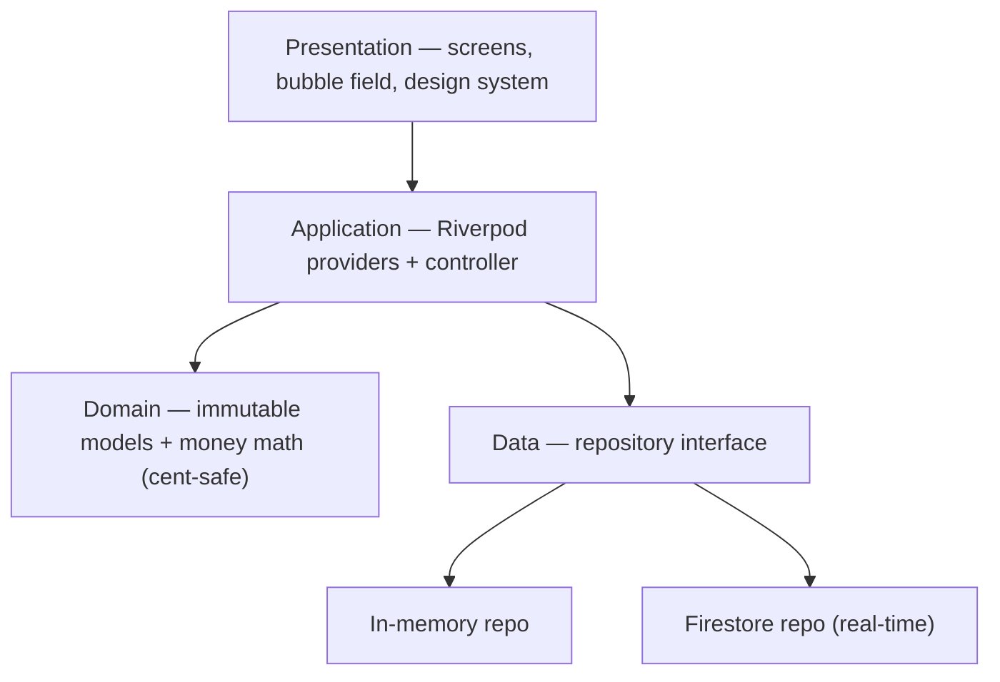

<div align="center">


# Bupples

**Split costs with friends — minus the awkward.**

[](https://flutter.dev)
[](https://firebase.google.com)
[](https://riverpod.dev)
[]()
[](LICENSE)

*A polished case study. The source code is private — available for review on request.*

</div>

---

## The idea

Splitting a group bill is a social tax: spreadsheets, screenshots, and chasing
friends for "the $14 you owe me." **Bupples** turns *who-owes-what* on any
hangout into a few taps — start a session, share a code, drop expenses, and it
computes the **fewest payments** to settle everyone up. Built mobile-first for a
Gen-Z audience, with a living, physics-driven UI.

## Screenshots

> _Drop your screenshots into `screenshots/` and they'll render here._

| Home | Session | Add expense | Settle up |
|------|---------|-------------|-----------|
|  |  |  |  |

<div align="center">

_Demo walkthrough:_ <!-- drop a demo.gif or a YouTube/Loom link here -->

</div>

## What it does

- 🫧 **Live bubble field** — each member is a physics-driven, draggable bubble
  sized by their balance. The cluster is *interactive*: bubbles bounce off UI
  cards and float up out of the way when a sheet opens.
- 🧾 **Flexible expenses** — split **equally / by exact amounts / by percentage /
  by shares**, with a **60-second undo** window plus full edit & delete (with a
  change trail).
- 🤝 **Smart settle-up** — minimal **"who-pays-whom" debt simplification**
  (≤ N−1 transfers), via a request → confirm → undo flow.
- 👥 **Sessions** — join by short code; configurable wrap-up (**host decides** or
  **unanimous vote**); lock-on-close, host delete, leave; per-session currency
  (+ custom) and budgets.
- 🔐 **Accounts** — silent anonymous by default; **Continue with Google** links
  your data so it backs up and follows you across devices; local persistence so
  nothing resets.
- 📊 **Per-member records** — tap a bubble for a breakdown of what they paid vs.
  owe and their full expense history.

## Tech stack

| Layer | Choices |
|-------|---------|
| **App** | Flutter · Dart (iOS · Android · Web) |
| **State** | Riverpod (StreamProvider / Provider.family + a controller) |
| **Backend** | Firebase — Cloud Firestore (real-time sync), Auth (Anonymous + Google), **App Check** |
| **iOS** | Swift Package Manager (no CocoaPods) |
| **Design** | Custom liquid-glass design system, a hand-rolled soft-body bubble simulation |

## Architecture

Feature-first and layered — UI depends only on repository **interfaces**, so the
in-memory backend and Firestore are interchangeable.



```
lib/
  app/theme/     design tokens + Material theme
  core/          palette, cent-safe money, shared widgets
  features/
    session/     sessions, expenses, members
    settlement/  debt-simplification ledger
    bubbles/     soft-body bubble simulation + render
    auth/        Google / anonymous sign-in
    onboarding/  tutorial + sign-in gate
```

## Engineering highlights

- **Debt-simplification ledger** — a greedy min-cash-flow algorithm reduces every
  pairwise IOU to the minimum number of transfers, computed purely from the
  expense stream.
- **Soft-body bubble physics** — a custom simulation (cohesion + pairwise
  repulsion + idle drift + UI-obstacle collisions) drives a 60fps, draggable,
  reactive cluster, with a ticker that sleeps when idle/backgrounded.
- **Security** — authorization is bound to the Firebase **auth uid** (not
  client-supplied ids): membership-scoped Firestore rules (no enumeration,
  members-only writes, host-only delete, server-validated amounts) + **App
  Check**. Hardened after a structured security audit.
- **Real-time + offline** — Firestore `snapshots()` push live updates to every
  participant; offline writes queue locally and flush on reconnect.

## Status

In active development; running on iOS, Android, and Web. The full source lives in
a private repository — **happy to share read access on request.**

---

<div align="center">

**Bupples** · © 2026 Yousof Selim · All Rights Reserved · Source available on request

</div>
