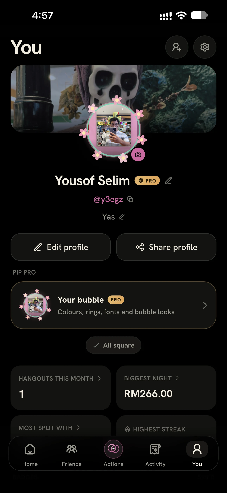
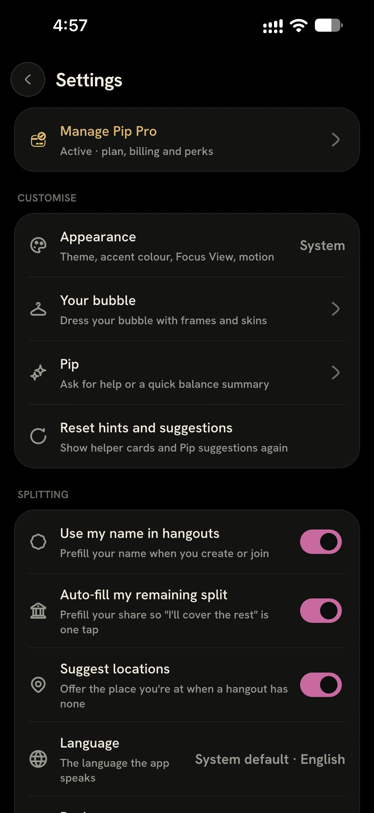
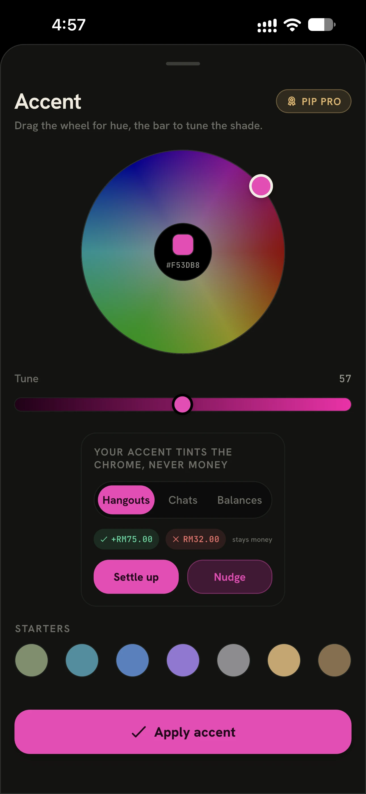

# Bupples

**Shared expenses. Clear balances. More time with your people.**

Bupples helps friends split dinners, trips and everyday costs. Create a hangout or a standalone split, scan a receipt, choose who had each item, and keep track of what remains to settle.

[App Store](https://apps.apple.com/my/app/bupples/id6777620291) · [Google Play](https://play.google.com/store/apps/details?id=com.bupples.bupples) · [Product site](https://bupples.web.app) · [Engineering case study](https://yousofselim.com/work/bupples/)

**Live on iOS and Android.** This is the public product and engineering showcase. Application source is private.

  
  
  

Current device screenshots supplied by the founder, September 2026. [View the capture set](media/README.md).

## What the product brings together

- **Shared expenses:** hangouts, standalone splits, receipt review and item-level claiming.
- **Clear settle-up plans:** cent-exact arithmetic, separate currency ledgers and server-checked settlements.
- **Private flows:** participant-scoped expenses and splits, with access enforced at the backend.
- **Personal expression:** custom profiles, accent colours and Pip Pro features, while financial colours keep their meaning.
- **Native integration:** iOS WidgetKit / SwiftUI and Android RemoteViews alongside the Flutter app.

## My contribution

I’m **Yousof Selim**, Bupples’ founder and sole developer. I own the product design, Flutter client, Firebase backend, security rules, native widgets, tests and store releases.

The central engineering challenge is trust: every split must preserve the total, retries must avoid duplicate money records, and private expenses must stay with their participants.

| Layer | Implementation |
| :--- | :--- |
| App | Flutter, Dart and Riverpod |
| Backend | Firestore, Firebase Auth, Storage and TypeScript Cloud Functions |
| Receipt processing | On-device text recognition and Gemini-assisted extraction, followed by user review |
| Native widgets | Swift / SwiftUI / WidgetKit and Kotlin / RemoteViews |
| Subscriptions | RevenueCat with server-checked entitlements |
| Release operations | Remote Config, Crashlytics, automated checks and store delivery |

## Release evidence

The [case study](https://yousofselim.com/work/bupples/) connects product decisions to implementation and dated release verification. Its 5 September 2026 snapshot for build 184 records **6,048 Flutter tests** and **91 native fixtures** for the verified build. These are development checks for that snapshot, not adoption metrics or a claim about every later build.

For current platform availability, use the store links above. The product website provides the landing page and supported browser claim flows.

## Engineering reading

- [Current case study: money, privacy, receipts and release](https://yousofselim.com/work/bupples/)
- [Architecture snapshot — build 1.1.0+112](docs/ARCHITECTURE.md)
- [Receipt splitting](docs/receipt-splitting.md)
- [Privacy and deletion](docs/privacy-and-deletion.md)
- [Release history](CHANGELOG.md)

The repository’s detailed engineering notes retain their documented build context. The case study and current screenshots are the starting point for the September product presentation.

[More work by Yousof](https://yousofselim.com) · [Discuss a project](mailto:yousofselim2@gmail.com)
