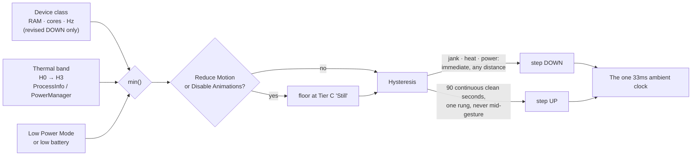
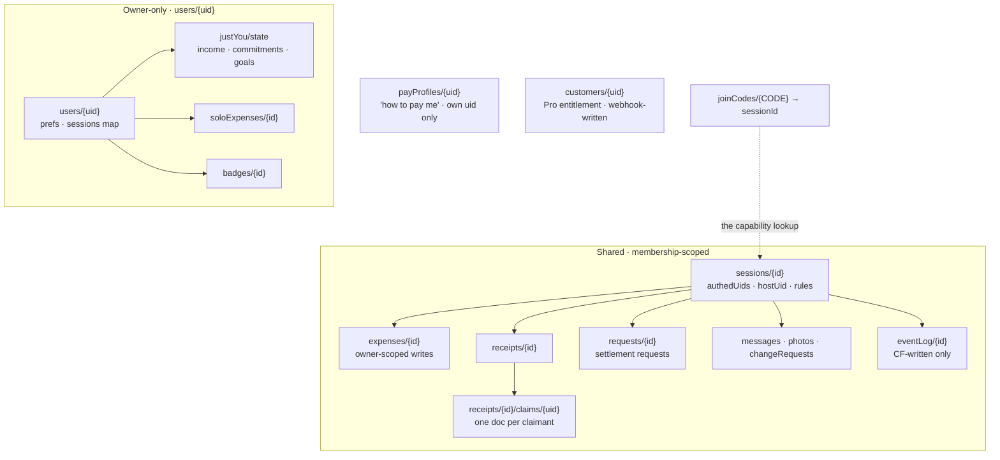
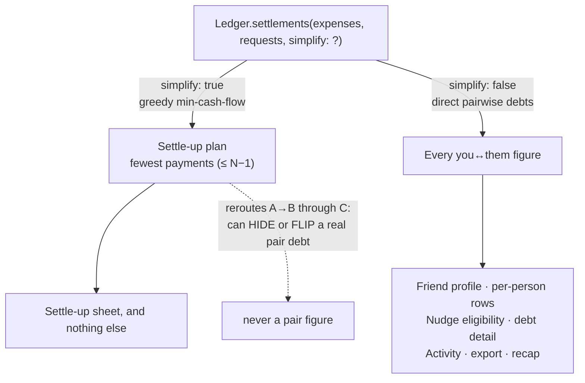
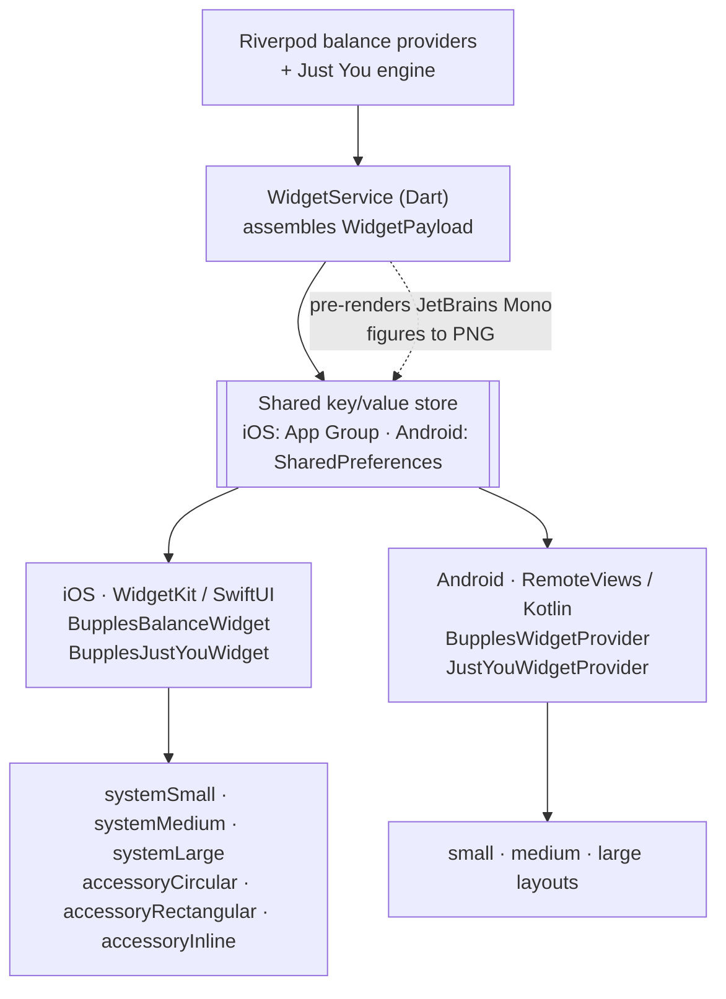

← [Back to the README](../README.md)

# Bupples: Architecture

A deeper look at how Bupples is built at `1.1.0+112`. This describes the system and
the decisions behind it; it contains no source and no secrets.

Bupples is a Flutter + Firebase expense-splitting app for iOS and Android. The social
unit is a **hangout**. The currency is **RM**, with ten other region packs behind it.
Everything below exists to defend one thing: **the figure on screen is correct, and it
is obviously correct.**

## Principles

1. **Money is law, not style.** Integer sen end to end. Colour carries meaning the
   user cannot override. Currencies never blend. Enforced by tests, not by reviewer
   discipline.
2. **The client proposes, the server disposes.** Balances, settlement acceptance,
   receipt finalisation and account deletion are decided by Cloud Functions and
   Security Rules. Audit logs are server-written.
3. **Determinism owns every number.** Pip narrates; pure Dart engines compute. No
   language model is ever the source of a figure.
4. **Decoration is a budget, not a right.** One ambient clock, one tier ladder, and a
   device that gets hot loses ambience before it loses frames.
5. **Fail open.** The remote control plane can disable a feature, but a config that
   never loads must leave a working app.

---

## 1. The client

### Layering

Feature-first under `lib/features/*`, with `lib/core` and `lib/app/theme` beneath it.
Each feature separates `domain` (immutable models, pure math), `application` (Riverpod
providers and controllers), `data` (repositories), and `presentation`.

The domain layer is the part that matters. `Ledger`, `SoloMoneyLeft`, the receipt
claim math and the settlement engine are pure Dart with no Flutter import and no I/O,
which is why they can be property-tested and why the same rules can be mirrored on the
server.

### State

Riverpod throughout: `StreamProvider` and `Provider.family` over Firestore snapshots,
with controllers for the write paths.

Two decisions are worth naming. First, the money chain (session doc, expenses,
receipts, requests, per joined hangout) is deliberately **app-lifetime and deliberately
unbounded**. A `limit` on an expense query would silently corrupt a balance, because
balances are conservation-checked sums over *all* counted expenses. Second, everything
route-scoped (a chat, pay profiles, change requests, photo pools) releases through a
`keepAliveWhile` helper with a 30-second grace, so a closed screen stops costing
anything within half a minute. `includeMetadataChanges` is banned app-wide and
grep-verified at zero.

### The design-token system

`lib/app/theme/glass_theme.dart` is the single theme surface: `AppType` for the type
roles, `GlassTokens` for the glass geometry, `BupplesSemantics` for the protected
colour roles, all exposed as one `ThemeExtension`.

Three families, each with a job: **Fraunces** for display, **Hanken Grotesk** for UI,
**JetBrains Mono** for figures. Money is always mono and always tabular, so a column of
amounts aligns and a changing digit does not shift its neighbours.

The important property is what the theme **refuses** to do. A user picks an accent; the
accent themes the app. It cannot reach the money roles, which are theme-constant per
brightness. See section 6.

### The Ambience Governor

`lib/core/motion/ambience.dart`, specified by the repo's Performance Doctrine and its
`docs/PERF.md` playbook. It exists because decoration is the first thing that should
yield when a device is struggling, and the last thing anyone remembers to budget for.

Every decorative motion in the app derives from **one** ambient clock, quantised to
**33 ms**. Not one ticker per bubble field, per glow, per shimmer: one. The consequence
is a hard ceiling of ~30 Hz on all ambient repaint regardless of panel rate, which is
what makes it safe to keep `CADisableMinimumFrameDurationOnPhone` enabled and let
*functional* motion (scrolls, transitions, gestures) run at ProMotion 120 Hz. The
surfaces you touch stay fast; the surfaces that idle stop burning battery.

How much life is allowed is a four-rung ladder:

| Tier | Name | What survives |
| --- | --- | --- |
| A | Lively | Up to 24 bubbles at 60 Hz sim, touch warp, gyro parallax, live blur, full ceremonies |
| B | Calm | Decoration halves: up to 14 bubbles at 30 Hz, no gyro, glow dropped, count-ups shortened |
| C | Still | Decorative loops freeze on their final frame; live blur only on modal sheets |
| D | Static | The ambience layer is removed entirely: flat gradient token, opaque glass fakes, fades capped at 150 ms |

Tier D is a deliberate design target, not a failure state: a complete, pleasant product
with zero decoration.

The tier resolves as:

```
tier = min(deviceCeiling, heatCeiling, powerCeiling)
```

`deviceCeiling` comes from a first-launch device class (RAM, cores, refresh rate),
`heatCeiling` from a unified four-band thermal ladder (H0 cold to H3 critical), and
`powerCeiling` from Low Power Mode or a low battery. Reduce Motion pins the result to
at least tier C, which is exactly the app's historical reduce-motion behaviour, so
accessibility and thermal safety share one mechanism instead of fighting each other.



The asymmetry is the point. **Down is immediate** on any trigger and can fall any
distance. **Up is earned**: one rung at a time, only after 90 continuous clean seconds,
never during a gesture or scroll, and the window restarts after each step. A phone that
is struggling degrades instantly; a phone that has recovered has to prove it for a
minute and a half before it gets its bubbles back.

Underneath sits a **self-heating audit**: if the app watches a device warm under its own
ambience across a 180-second window, that device's ceiling can be lowered permanently.
The app learns that this particular phone cannot afford tier A and stops trying. Two
shipped fixes guard the edges of that power, and both read as bug titles that could only
exist in a system like this one: a debug or profile build must never permanently freeze
a device, and neither Low Power Mode nor a stale device class may.

Thermal input comes from the `thermal` package's platform stream (iOS
`ProcessInfo.thermalState`, Android `PowerManager` THERMAL_STATUS), mapped by a pure,
unit-tested function onto the governor's four bands. Escalation maps conservatively
upward: anything at or past `severe` pins ambience still immediately.

### Motion tokens and the ratchet

All durations, curves and springs come from a `Motion` token set (`micro` / `quick` /
`standard` / `gentle` / `grand` / `reveal`). Custom lints need a package, so enforcement
is a **ratchet test** instead.

`test/motion_duration_ratchet_test.dart` walks every file in `lib/`, counts raw
`Duration(` literals, and compares against a checked-in baseline recording the debt each
pre-token file already carried. The build fails when a file exceeds its baseline, and
fails when a file **not** in the baseline contains a literal at all. New code therefore
cannot introduce a raw duration; old code can only ever pay its debt down.
`lib/core/motion/**` is the one sanctioned home, because the token files own the
literals.

The mechanism has already done real work. One commit in the shipping history reads
"Motion ratchet: receipt claim controller uses the token; baseline the geocoder GPS
timeout": the ratchet caught two new literals, one was migrated onto a token, and the
other was a genuine non-motion timeout that had to be argued into the baseline. Forcing
that argument is the whole design.

---

## 2. Data model and rules posture

The store is Cloud Firestore. The shape follows the trust boundary, not the UI.



Five things define the posture.

**Authorisation is bound to the auth uid.** Every rule checks `request.auth.uid` against
`authedUids` or `hostUid` on the session document, never a client-supplied member id. A
scripted client cannot impersonate its way into a hangout.

**Sessions cannot be enumerated: the capability-URL design.** There is no listable
sessions collection. A session document is readable only if you already hold its
unguessable id, and the only route to that id is `joinCodes/{CODE}`, a share code mapped
to a session id. Knowing the URL *is* the capability. That is what lets a share link work
for a friend with no account while a scraper with a perfectly valid login still cannot
discover a single hangout it was not given. Membership growth then goes through the
`joinSession` Cloud Function (admin SDK), which enforces bans, so clients cannot grow
`authedUids` themselves at all.

**Private data is owner-only.** Everything under `users/{uid}` (the Just You state, the
solo expense ledger, preferences) is readable and writable by that uid alone.
`payProfiles/{uid}` is writable only by its own uid, so payment handles cannot be
tampered with through a session document. `customers/{uid}`, which carries the Pro
entitlement, is written by the RevenueCat webhook and never by a client.

**Some collections are deny-by-default on purpose.** The rate-limit buckets, scan quotas
and Pip quotas have no `match` block at all. The default deny keeps clients out and only
the admin SDK touches them.

**Cosmetics have a money boundary too.** Free and badge-earned bubble frames are
client-equippable in the rules; Pro frame ids are explicitly denied there. The only route
onto a Pro frame is the `equipProFrame` Cloud Function, which re-checks the live
entitlement first. What rules can cheaply express, rules express. What they cannot check,
a function does.

The rules suite carries **294 tests**.

### App Check: honest status

App Check is plumbed through **every** callable behind a single constant, so enabling it
is a one-line change that cannot miss a function. That constant is currently `false`, and
deliberately so: the Android client cannot ship `firebase_app_check` while the plugin
fails to compile on AGP 9 / Kotlin 2.3, and enforcing would reject every Android call and
all local testing.

So App Check is **wired but not enforced** at `1.1.0+112`. Access control today rests on
Firebase Auth plus the 294-test rules suite. The enable path is written into the source:
restore the plugin when it compiles, confirm attestation on TestFlight and Play internal,
flip the constant, deploy by name. Claiming "App Check protected" today would be false,
so it is claimed nowhere in this repo.

---

## 3. The backend: 71 Cloud Functions

TypeScript, Cloud Functions v2, deployed **by name only**, because the production project
carries live functions this repo does not, so a bare `functions deploy` would delete
them.

| Trigger | Count | Owns |
| --- | --- | --- |
| `onCall` | 36 | Every money and membership write the client is not trusted to make |
| Firestore document | 24 | Push fan-out, projections, cover healing, counters |
| `onSchedule` | 10 | Auto-confirm, auto-approve, recurring expenses, Just You, sweeps |
| `onRequest` | 1 | The RevenueCat webhook |

Every money callable opens the same way: `assertNotMaintenance()` first, then auth, then
a parsed and validated input schema, then a rate-limit bucket, then an idempotency key.
Maintenance mode pauses money writes before anything else can happen.

The ones worth naming:

- **`settleDirect`**: settlement acceptance is verified server-side, so it cannot be
  forged or self-accepted.
- **`autoConfirmSettlements`** (scheduled): the 72-hour auto-confirm window, off by
  default per user.
- **`finalizeReceipt`**: materialises a claimed receipt into one exact-split expense,
  counted exactly once, rate-limited and idempotency-keyed.
- **`scanReceipt`**: Gemini on Vertex AI, structured JSON out.
- **`askPip`**: the assistant, with the guardrails in section 5.
- **`deleteAccount`**: anonymise, not purge (section 7).
- **`revenueCatWebhook`**: verify-then-write. It never trusts the event payload's
  entitlement claims; it re-reads the subscriber from the RevenueCat REST API before
  writing `customers/{uid}`.
- **`nudgeToSettle`**: writes the who-nudged-whom record into a client-unwritable event
  log.
- **The four Just You schedules**: section 4.

### The money twin

`functions/src/receipt_math.ts` is the deliberate server-side twin of the Dart receipt
claim math. The client previews shares with the Dart copy; `finalizeReceipt` writes money
with the TypeScript one; the two must agree to the sen. Both work in integer sen and use
exact rational arithmetic (bigint on the server) so rounding is deterministic on both
sides.

The invariants are property-tested on the Dart side and stated in the server source:

- `sum(memberItemSubtotals) + unclaimedPot == sum(item amounts)` **exactly**, for any
  input, with over-claims clamped deterministically first.
- Proportional tax and service conserve their totals exactly, by largest remainder over
  claimed subtotal.
- Split-rest-equally conserves the pot exactly, the extra sen going to the first member
  ids in sorted order.

Maintaining two implementations of money math in two languages is a real cost, taken on
purpose. The alternative is trusting a client with the write.

---

## 4. Just You

A private personal-money space, Pro-gated, living entirely under `users/{uid}`: the spend
ledger at `soloExpenses/{id}`, and all planning state (income, fixed commitments, savings
goals, notification settings, notify guards) in one `justYou/state` document.

The engine is `soloMoneyLeftOf`:

```
money-left = income − committed − spent − goalContributions
```

All integer sen, one currency, never a blend. The interesting constraint is **never
double-count a paid commitment**. Commitments and discretionary expenses are disjoint
data sets by construction: a commitment lives in the commitments list, a logged spend
lives in the ledger, and marking a commitment paid is a *reminder status* that never
mints a second expense. So a commitment's amount is subtracted exactly once, and the paid
flag does not move money-left at all.

That is both the correct reading and the intuitive one: a bill you already budgeted for
does not free up cash when you finally pay it. The tempting alternative, moving the amount
from committed to spent for the same sum, nets out only while nothing else touches either set,
and double-counts the moment anything does.

Four scheduled Cloud Functions do the upkeep a phone cannot, because the phone may be
asleep when a bill is due. All four run in **Asia/Kuala_Lumpur (UTC+8, no DST)**, so the
month boundary, the due-day maths and the quiet-hours window all read Malaysia wall clock
rather than UTC:

| Function | Schedule | Job |
| --- | --- | --- |
| `justYouMonthlyRollover` | `0 0 1 * *` | Reset each commitment's paid flag for the new period. No push. |
| `justYouBillReminders` | `0 9 * * *` | A heads-up before a fixed commitment is due and unpaid. |
| `justYouBudgetCheck` | `0 19 * * *` | A word when spend runs ahead of the month, or money-left is low. |
| `justYouMonthEndSummary` | `0 20 28-31 * *` | A short spent/left recap near month end. |

The server mirrors the client engine faithfully and computes the identical figure from
the identical inputs. When it *cannot* compute honestly, income in a different currency
from the month's dominant spend say, **the nudge is skipped** rather than approximated.
A push that states a number is a promise that the number is right.

Idempotency is per-type: bill reminders guard per commitment per period, the budget check
per day or week, the summary per month, the rollover by month key. A retried delivery
finds its guard already set and does nothing.

---

## 5. Pip

Pip is the mascot and the assistant: an animated `CustomPainter` in the app, redrawn
natively in a SwiftUI `Canvas` for the widgets, and a Gemini model on Vertex AI behind
the `askPip` callable.

**The guardrail: Pip never computes a figure.** The client computes every number
deterministically with the ledger and hands Pip a context block of already-computed
figures. Pip's system instruction is explicit that the amounts are final and that it must
never invent a number or redo math that contradicts the context. Currencies are separate
ledgers in the prompt too: never add, net or convert across them, always say which
currency a figure is in, never merge into a single total. Pip is also forbidden from
inventing app features, and is given the real button names so a "how do I" answer matches
the actual UI.

A system prompt is a request, not a guarantee. So the Just You module adds a
**post-generation validator** (`solo_pip_validator.dart`): it reads Pip's generated
narrative, finds every monetary figure in it, normalises each to sen, and lets the
narrative through **unchanged** only when every figure was in the allowed input payload.
Anything invented, estimated or miscalculated rejects the whole narrative and the caller
shows a deterministic fallback instead. It is **fail-closed** (an unparseable
money-shaped token forces the fallback) and pure, with no I/O, no clock and no Pro gate,
so it can be tested adversarially.

The adversarial test (`test/solo_pip_validator_test.dart`) is the good part. It proves
the validator catches:

- an invented figure ("that new phone at RM2,499.00") when RM2,499.00 was never in the
  payload;
- **a miscalculated total whose operands are both legitimate**: "Food RM214.00 plus your
  bills leaves you RM534.00", because RM534.00 itself was never sourced. This is the
  case a naive check for unknown tokens would wave through, and it is exactly the case a
  language model actually produces;
- an unsourced RM-prefixed integer, and unsourced thousands-grouped magnitudes;
- equivalent formats matching, so "RM1,234.50", "RM 1234.5" and a bare `123450` all
  collapse to one value and a legitimate figure is not rejected on formatting;
- and that percentages, dates and bare counts are **not** treated as unsourced money, so
  the guardrail does not fire on ordinary prose.

**Honest scope:** the validator is a pure, tested module in the Just You domain layer. At
`1.1.0+112` it has no production call site. The deterministic engines and the rule-based
insight engine own every figure Just You currently shows, so nothing routes a Pip
narrative through it in the shipping build. It is the enforcement written and proven
ahead of that path going live. It is described here as what it is.

---

## 6. The money law

Every layer above defends this. It is a system with tests, not a style guide.

**Integer sen everywhere.** No float touches money, in Dart, in TypeScript, or in Swift.
Splitting across weights uses one deterministic distributor: floor each share, then hand
leftover sen out largest-remainder-first, so the parts always sum back to the exact
total. That routine is the trust anchor and everything else composes it.

**Colour is direction, and the user cannot touch it.**

| Role | Meaning | Constraint |
| --- | --- | --- |
| Mint | Owed to you | Theme-constant per brightness |
| Coral | You owe | Theme-constant per brightness |
| Gold | Pip Pro | The one sanctioned gold |
| Neutral | Even / settled | |

The user's accent colour may **never** touch a monetary figure. This is not a convention,
it is guarded from several directions at once. `test/theme_tokens_test.dart` asserts that
within a brightness, every accent yields the same money colour.
`test/accent_guardrail_test.dart` proves a reload can never resurrect an in-band accent.
`test/detail_sheet_accent_guardrail_test.dart` proves a green accent pick can never render
mint-*adjacent* on a money sheet, and a coral pick never coral-adjacent, because the
danger is not merely *equalling* mint, it is landing close enough to be misread as mint.
`test/pay_action_semantics_test.dart` pins the pay action to the brand accent and away
from any money-semantic hue. The custom accent wheel ships with the money guardrail built
into the picker itself, so an out-of-bounds colour cannot be chosen in the first place.

Light and dark need different money shades, and both must pass WCAG AA on their own
surface. The vivid dark pair (mint `#46E0B0`, coral `#FF7D7D`) cannot clear AA on warm
paper, so light mode resolves to deeper, more saturated values (`#2A7350` / `#AC4C3B`),
with the measured contrast ratios recorded beside the constants. Pro gold does the same
for the same reason: bright gold reads at roughly 12:1 on dark and 1.5:1 on paper, so
light mode uses a deep antique gold instead. The counter-intuitive lesson, learned by
measurement: deeper light themes want *more* saturation, not less.

**No sign prefixes by default.** Direction is carried by an arrow, the colour, and words.
A `+`/`−` prefix is opt-in for genuinely signed balance displays, and uses U+2212, not a
hyphen.

**Currencies never blend.** Each currency is an independent ledger, everywhere, because
there is no exchange rate in this app and a guessed conversion is a wrong number wearing a
right number's clothes. The nudge engine builds direct debts *within* each currency and
flattens them, so a debtor who owes you THB stays nudgeable even when the cross-currency
net happens to be zero. The widget never blends. Pip is forbidden from blending. Just You
filters to a single currency before the engine runs.

### The direct-settlement trap

The one that would have shipped a wrong number.

`Ledger.settlements(...)` takes a required `simplify` flag. With `simplify: true` it runs
a greedy min-cash-flow solver: the group nets to the fewest payments, at most N−1
transfers. That is the right default for *settling a hangout*, because nobody wants to
make four transfers when one will do.

It is catastrophically wrong for **any you-to-them figure**. Simplification reroutes a
real pair debt through a third person. If A owes B and B owes C, the solver may
legitimately produce "A pays C" and erase the A→B line entirely. So a friend-profile
balance, a per-person row, an offline-person screen or a nudge built on the simplified
plan can **hide a debt that exists, or show one pointing the wrong way**.

An adversarial review caught exactly this on the offline-member screen at build 103. The
rule is now absolute: **any you-to-them balance uses `simplify: false`**. The direct call
sites are every place it matters: the per-person settle providers, the nudge engine, the
debt detail sheet, the activity balances, the member sheet, the session report, the export
and the recap.



Nudge eligibility reads the direct debt specifically, so you cannot nudge someone over a
balance that only *appears* to point your way through a routing artefact.

Both views stay pure read-side transforms over one ledger, so Summary and Full always
reconcile. And `netBalances` derives from the *same* accepted-payment-clamped pairwise
debts the direct settle uses, so an over-applied payment (a double-accept, or a bill
edited down after its payment was accepted) can never invent a reverse debt.

One more gate sits at the source: a pending or rejected expense is excluded from all money
math in a single place (`_counting`), so every derived figure agrees automatically and
conservation still holds (the sum over counted expenses nets to zero).

---

## 7. Privacy, deletion, and trust

**Deletion anonymises, it does not purge.** Bupples holds shared financial records for
people who trust each other, so one person's privacy choice cannot be allowed to destroy
proof other people depend on. `deleteAccount` runs server-side and rewrites only *this*
user's identity across every session: the name becomes "Deleted user", the auth uid and
pay handles are dropped, and the expenses, transfers and receipts other participants rely
on stay intact. Pool photos they uploaded are anonymised, keeping the shared memory and
scrubbing the identity. You can leave, but you cannot delete your way out of a debt. This
also satisfies App Store Guideline 5.1.1(v), with Apple token revocation for Apple-linked
accounts.

**Sessions archive, they do not vanish.** Removal is a one-way soft-archive: records
freeze, stay exportable by everyone who was in them, and stay readable. There is no client
path to a hard delete of shared financial data.

**Locks preserve proof.** Once a receipt is added to balances it locks (items, amounts,
title), enforced in the app and in the rules, so the recorded expense can never drift from
its proof. Pre-settle edits are owner-approved correction requests appended to a
server-written history.

**No ad SDKs, no IDFA, no ATT prompt.** Verified: no ad or attribution SDK in
`pubspec.yaml`, and no `NSUserTrackingUsageDescription` in `Info.plist`, because there is
nothing to ask permission for. Bupples is a calculator, not a wallet: it records that a
settlement happened and never moves money, so there are no card or bank details to leak.

Depth: [privacy and deletion](privacy-and-deletion.md).

---

## 8. The remote control plane

Firebase Remote Config, with baked-in client defaults. Every switch **fails open**: a
config that never loads leaves a fully working app.

| Parameter | Purpose |
| --- | --- |
| `pip_assistant_enabled` | Kill switch. Off = Ask Pip surfaces degrade gracefully. |
| `receipt_scan_enabled` | Off = the unavailable card; manual entry still works. |
| `nudges_enabled` | Off = the nudge button hides. |
| `paywall_enabled` | Off = paywall entries hide; existing Pro is unaffected. |
| `maintenance_mode` | The client wall. The server template copy blocks money writes independently. |
| `force_update_enabled` + `app_version_gate` | Per-platform `minSupportedBuild` (hard wall) and `latestBuild` (soft nudge). |
| `announcements` | In-app banner array. `[]` = none. |
| `whats_new` | The full release-notes payload, current + history. |
| `region_packs` | Per-region currency, QR scheme, banks, e-wallets, bank-field schema. |
| `pip_daily_message_cap` | Free-tier Ask-Pip quota. |

Two details make this more than a feature-flag list.

**Maintenance is two-sided.** Flipping the client flag shows the wall, but the server
template is set independently and every money callable opens with
`assertNotMaintenance()`. A client that ignores the flag still cannot write money. The
kill switch does not depend on the thing it is killing.

**The version gate is dangerous, and documented as such.** The parameter description in
the template carries the operational rule in capitals: never set `minSupportedBuild` above
the build currently under Apple review. A force-update gate that outruns review bricks the
app for everyone in the review queue, reviewer included.

The store URLs in the gate are still placeholders (`idPLACEHOLDER`, and an Android id that
does not match the real `applicationId`). The gate is off (`minSupportedBuild: 0`) so
nothing is gated, but those must be fixed in the console before force-update is ever
enabled. Flagged here rather than quietly omitted.

### Region packs

Your region sets your currency and the correct local payment rails. Eleven packs ship in
the template (MY, SG, TH, ID, IN, BR, US, GB, AU, EU, and a ZZ fallback), each carrying a
default currency, a payment QR scheme name, a bank list, an e-wallet list, a bank-field
schema and an examples key.

The QR scheme is the part that matters, because it is the part an outsider gets wrong:
**DuitNow** in Malaysia, **PayNow** in Singapore, **PromptPay** in Thailand, **QRIS** in
Indonesia, **UPI** in India, **PIX** in Brazil, and `null` where no consumer QR rail
exists (the US, the UK, Australia, the EU) rather than a pretend one. The bank-field
schema follows the same logic: `routingNumber` for the US, `sortCode` for the UK, `bsb`
for Australia, `iban` for the EU, `generic` elsewhere. A new region ships without an app
release, overlaying the baked generic pack.

---

## 9. The widget bridge

One Dart payload, two native renderers, zero live network calls.



The Dart side assembles a payload from the live balance providers and pushes it through
`home_widget` to both platforms via the App Group `group.com.bupples.widgets`. Every call
is wrapped so the whole layer no-ops cleanly on web (where the plugins throw
`MissingPluginException`) and never throws into app code. **The widgets never make a
network call.** They render what the app last published, which is also what makes them
cheap and what makes them consistent with the app by construction.

**iOS** ships six families from one timeline provider: `systemSmall`, `systemMedium`,
`systemLarge`, plus the three Lock Screen accessories (`accessoryCircular`,
`accessoryRectangular`, `accessoryInline`). Pip is redrawn natively in SwiftUI so he stays
on-model at every size, and a `MoneyFormatter.swift` re-implements the money law on the
Swift side: integer minor units, mint/coral by direction, currency-aware, never blended.

**Redaction is a first-class case.** Every monetary figure is marked `.privacySensitive()`
so amounts redact when the device locks. A balance widget on a Lock Screen is a balance
visible to anyone who picks the phone up, and the accessory families are *specifically*
the Lock Screen ones. The SwiftUI previews cycle each family through the money states so
redaction, staleness and monochrome accessory handling can all be eyeballed.

**Android** is where the interesting constraint lives. RemoteViews cannot set an arbitrary
typeface at runtime, and money must be JetBrains Mono, tabular, coloured by direction, the
same law as everywhere else. So the Dart side **pre-renders the figures to PNGs** in the
correct font and the correct mint or coral, and passes them as image keys the provider
draws into an `ImageView`. If a PNG is absent or undecodable the provider falls back to a
Kotlin monospace `TextView`: degraded, but **never a proportional font**, because a
proportional font on a money figure is a number that looks wrong.

Both platforms carry a second, Pro-gated Just You widget reading the same App Group
payload, reloaded alongside the balance widget on every push.

---

## 10. Platform notes

**iOS is Swift Package Manager only**, no CocoaPods. Every dependency ships a
`Package.swift`. The widget extension, the QR scanner plugin and the Firebase stack all had
to fit that constraint; `workmanager` breaks pure SPM and was dropped rather than
compromise the setup.

The build cycle worth recording: the release build failed with "Cycle inside Runner" until
the Runner target's build phases were reordered so **Embed Foundation Extensions runs
before Thin Binary**. The real cycle was Embed ↔ Thin Binary ↔ `Info.plist`, not the App
Intents metadata it first appeared to be, which is why the obvious fix did not work. Fixed
via the `xcodeproj` gem from the CLI; `flutter build ios --release` is clean and the widget
extension still embeds.

**Web is one page, not an app.** The full Flutter web app was **removed**. `/app` now
302-redirects to the landing page, and Bupples ships iOS and Android only. What remains on
Firebase Hosting is the marketing site plus a small set of static pages: `/t/CODE` so a
friend without the app can claim a Turbo split from a browser, `/j/CODE` for join links,
`/@handle` profile pages, and the legal pages. `turbo-ledger.js` is the parity-tested
JavaScript port of the split math the claim page runs.

---

## 11. Quality

| Check | Result |
| --- | --- |
| Flutter suite | **2,581 passing / 0 failing** at `1.1.0+112` across ~321 test files, one known `pumpAndSettle` hang held out |
| `flutter analyze` | No issues found |
| Functions `tsc --noEmit` | Clean |
| Functions unit tests | 50 / 50 |
| Firestore rules tests | 294 / 294 |
| Builds | Real-device iOS and Android release builds |
| Subscriptions | RevenueCat, live on both stores |

The suite is not decoration. The release-readiness gate for `1.1.0+110` was run as an
adversarial pass against the app, and it found a **real** Reduce Motion crash: a skeleton
shimmer held its `AnimationController` in a `late final` field, so the low-tier and
Reduce-Motion early return in `initState` left it unconstructed, and `dispose()` then
triggered the `late` initialiser, building a Ticker at teardown and doing an ancestor
lookup on a deactivated element. Any skeleton shown and then torn down under Reduce Motion
threw. That bug is a direct consequence of having an ambience ladder at all, which is the
honest cost of section 1.

Four other failures in that pass were stale tests reconciled to the shipped redesign, and
one apparent monetisation leak was investigated and confirmed not to be one. No product,
money or Pro-gating logic was changed to make a test pass, which is the only rule that
makes a test suite worth anything.

Known and flagged rather than hidden: App Check is not enforced (section 2); the
`app_version_gate` store URLs are placeholders (section 8); one `pro_profile_card_test`
hang is held out of the suite; the repo is not `dart format`-clean.

---

## Further reading

| Doc | What's inside |
| --- | --- |
| [Receipt splitting and the money model](receipt-splitting.md) | Cent-safe math, the multi-payer net-position ledger, collaborative real-time receipts, the Dart ↔ TypeScript twin |
| [Privacy, deletion, and trust](privacy-and-deletion.md) | Anonymise-not-erase, soft-archive, the capability-URL design, rules posture |
