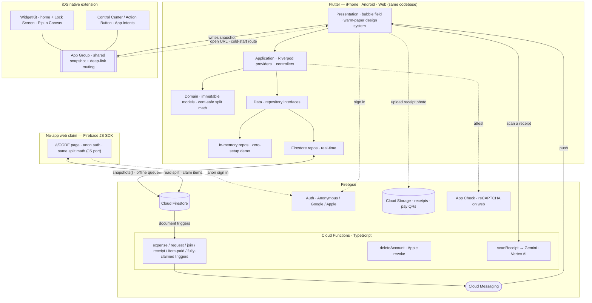

← [Back to the README](../README.md)

# Architecture

Bupples is one Flutter codebase that ships as the iPhone app, the full web app,
and the data source behind a native iOS widget extension. The design goal is that
**the same domain logic and the same money math run everywhere**, and that
anything which must be trusted runs on the server, never the client.

## Layers

The app is **feature-first and layered**. UI depends only on repository
*interfaces*, so the in-memory backend (zero-setup demo) and the Firestore
backend are interchangeable.

```
lib/
  app/theme/     design tokens + Material theme
  core/          palette, cent-safe money, deep links, services, shared widgets
  features/
    session/     sessions, expenses, members, settlement, transfer details,
                 collaborative real-time receipts (model · claims · settle · screen)
    turbo/       Turbo receipt splits — domain (split, items, claims, ledger,
                 receipt parser) · data · application · screens (create / share / claim)
    bubbles/     soft-body bubble simulation + render
    auth/        Google / Apple / anonymous sign-in
    settings/    profile, preferences, account deletion
    onboarding/  tutorial · sign-in gate · first-run setup (name · currency · theme)
functions/       Cloud Functions (TypeScript): notify, deleteAccount, apple, scanReceipt
ios/
  Runner/        UIScene lifecycle + deep-link routing (native → Flutter)
  BupplesWidgets/  WidgetKit views, native Pip (SwiftUI Canvas), Control widgets,
                   shared snapshot via App Group
public/          Firebase Hosting — full Flutter web build at /app, the no-app
                 /t/CODE claim page, and the JS split-math port (parity-tested)
```

- **Presentation** — the warm-paper design system and the live bubble field.
- **Application** — Riverpod `StreamProvider` / `Provider.family` + controllers.
- **Domain** — immutable models and the cent-safe split math (see
  [receipt splitting](receipt-splitting.md)).
- **Data** — repository interfaces, implemented by either in-memory or Firestore
  repos.

A serverless backend (Cloud Functions) handles everything that must be trusted,
fanned-out, or external: push notifications, recursive account deletion, Apple
token revocation, daily FX rates, settle-up reminders, and **receipt scanning**
via Gemini on Vertex AI.

## System diagram



## Decisions worth calling out

- **Repository interfaces over a hard Firestore dependency.** The UI never imports
  Firestore. That kept an in-memory demo backend working the whole way through and
  made the Firestore rules the only place trust is enforced.
- **Server-authoritative, not client-trusting.** Balances, settle-up acceptance,
  account deletion, and the "everyone's paid" signal are decided on the server.
  Clients propose; Cloud Functions and Security Rules dispose.
- **One ledger, many views.** The simplified ("fewest payments") plan and the full
  who-owes-whom view are pure read-side transforms over a single balance ledger, so
  they always reconcile. See [receipt splitting](receipt-splitting.md).

## Runtime engineering

- **Serverless push pipeline** — Firestore-triggered Cloud Functions fan out FCM
  notifications to a session's members (new expense, settle-up request, join,
  receipt uploaded, the item-exact "everyone's paid" event, the owner
  "fully-claimed" cleanup nudge, and a polite "you still owe" reminder sent on
  demand or on a daily schedule). Each push carries a **deep-link payload** that
  opens straight to the relevant receipt, split, settle-up, or session. Per-device
  tokens re-bind on account switch and prune when stale; reminders are throttled
  per recipient on the server.
- **One codebase, three surfaces** — the same app compiles to the iPhone build, the
  full web app (served at `/app` on Firebase Hosting, App Check attested with
  reCAPTCHA v3), and feeds the native iOS extension. See
  [web and native](web-and-native.md).
- **Account-scoped image cache** — avatars are cached to a per-user on-device file
  store keyed by the storage URL (which carries a version token), so they load
  instantly and never re-download, while a sign-out or account switch wipes the
  cache so one account can never surface another's faces. Built without a native
  database to stay on the project's CocoaPods-free Swift Package Manager setup.
- **Battery-aware lifecycle** — a top-level ticker freezes every animation the
  instant the app leaves the foreground (app switcher, Control Center, background)
  and resumes on return, so a backgrounded Bupples does no rendering work.
- **Soft-body bubble physics** — a custom simulation (cohesion + pairwise repulsion
  + idle drift + UI-obstacle collisions) drives a draggable, reactive cluster that
  targets 60fps, with a ticker that sleeps when idle or backgrounded.
- **Real-time + offline** — Firestore `snapshots()` push live updates to every
  participant; offline writes queue locally and flush on reconnect.
